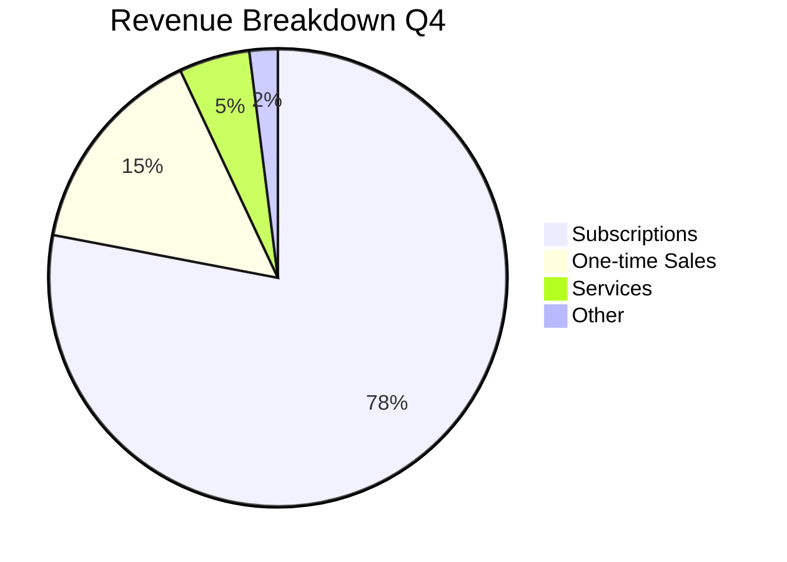
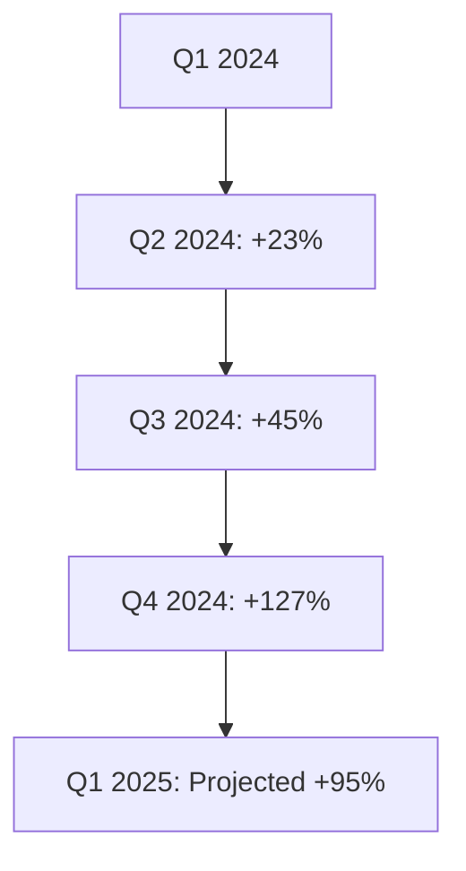
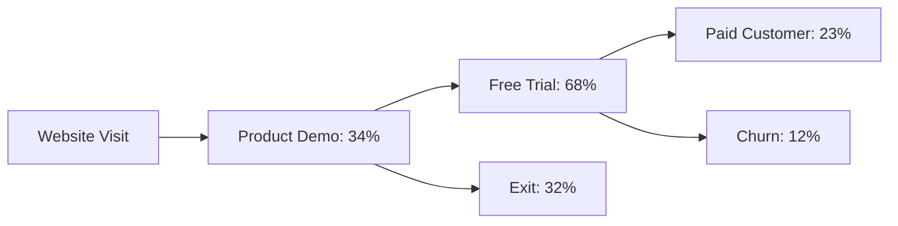
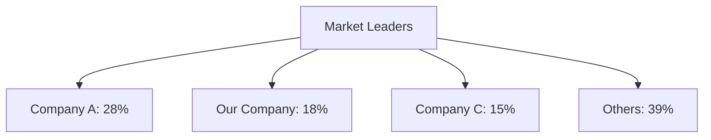

```json frontmatter
{
  "title": "Q4 Business Analytics Dashboard",
  "theme": {
    "mode": "auto",
    "colors": {
      "light": {
        "primary": "#2563eb",
        "secondary": "#6b7280",
        "background": "#ffffff",
        "surface": "#f8f9fa",
        "text": "#1a1a1a",
        "text-secondary": "#6c757d"
      },
      "dark": {
        "primary": "#60a5fa",
        "secondary": "#9ca3af",
        "background": "#1a1a1a",
        "surface": "#2a2a2a",
        "text": "#ffffff",
        "text-secondary": "#a1a1aa"
      }
    }
  },
  "navigation": {
    "order": [
      "key-metrics",
      "revenue-analysis",
      "growth-trends",
      "customer-insights",
      "market-analysis",
      "recommendations",
      "glossary"
    ]
  },
  "hero": {
    "title": "Q4 Performance Analytics",
    "subtitle": "Data-driven insights for strategic decision making and growth optimization.",
    "callToActions": [
      {
        "text": "📊 Explore Metrics",
        "link": "#key-metrics",
        "primary": true
      },
      {
        "text": "🔗 View Live Dashboard",
        "link": "https://analytics.example.com",
        "primary": false
      }
    ]
  },
  "glossary": [
    { "term": "CAC", "definition": "Customer Acquisition Cost: The total cost of acquiring a new customer." },
    { "term": "LTV", "definition": "Customer Lifetime Value: The total revenue expected from a customer over their relationship with the company." },
    { "term": "Churn Rate", "definition": "The percentage of customers who stop using a service over a given period." },
    { "term": "MRR", "definition": "Monthly Recurring Revenue: The predictable revenue generated each month." }
  ]
}
```

## Key Performance Metrics {#key-metrics}

Our Q4 performance shows significant improvement across all major business metrics. The data indicates strong market positioning and effective growth strategies.

```kpi-grid
[
  { "label": "Revenue Growth", "value": "+127%" },
  { "label": "Customer Acquisition", "value": "3,240" },
  { "label": "Churn Rate", "value": "2.1%" },
  { "label": "MRR", "value": "$89K" },
  { "label": "CAC", "value": "$127" },
  { "label": "LTV", "value": "$2,340" }
]
```

## Revenue Analysis {#revenue-analysis}

Revenue streams have diversified significantly, with subscription models now accounting for 78% of total revenue. This shift to recurring revenue has improved predictability and reduced cash flow volatility.



### Growth Trends {#growth-trends}



## Customer Insights {#customer-insights}

Customer behavior analysis reveals key patterns that inform our product development and marketing strategies.



> The best way to predict the future is to create it.
>
> — Peter Drucker

## Market Position Analysis {#market-analysis}

Competitive analysis shows our market share has grown from 12% to 18% in the past quarter, positioning us as the second-largest player in our segment.



## Strategic Recommendations {#recommendations}

Based on the Q4 analytics, we recommend focusing on three key areas for continued growth and market leadership. For detailed implementation plans, see our [strategic roadmap](https://strategy.example.com) and the [customer retention study](#customer-insights).

```kpi-grid
[
  { "label": "Product Expansion", "value": "Priority 1" },
  { "label": "Market Penetration", "value": "Priority 2" },
  { "label": "Customer Retention", "value": "Priority 3" }
]
```

## Terminology Guide {#glossary}

```glossary
```
