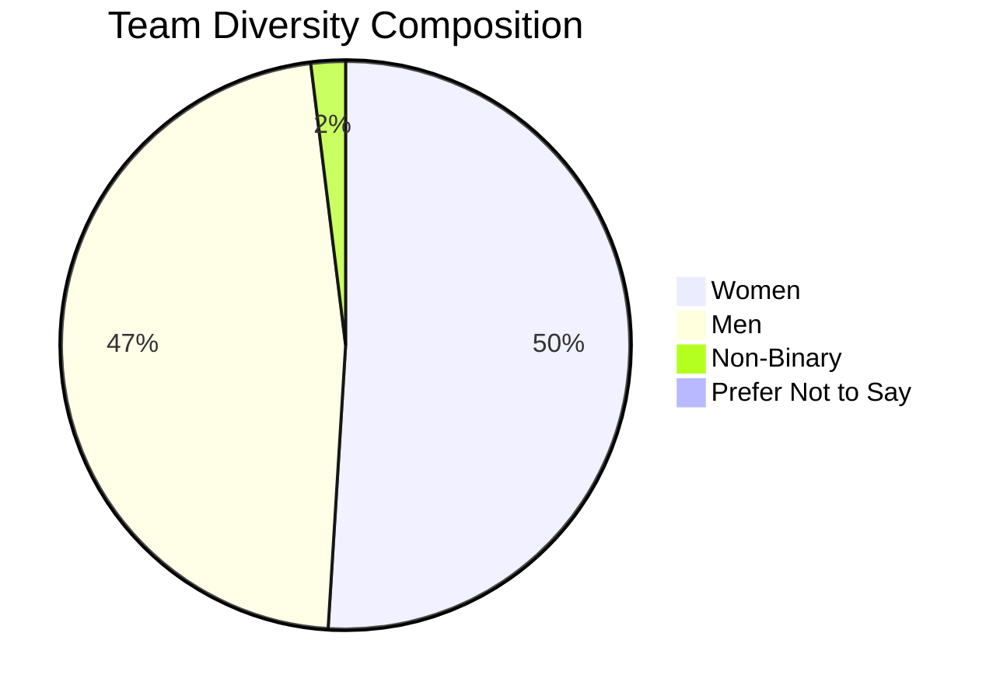
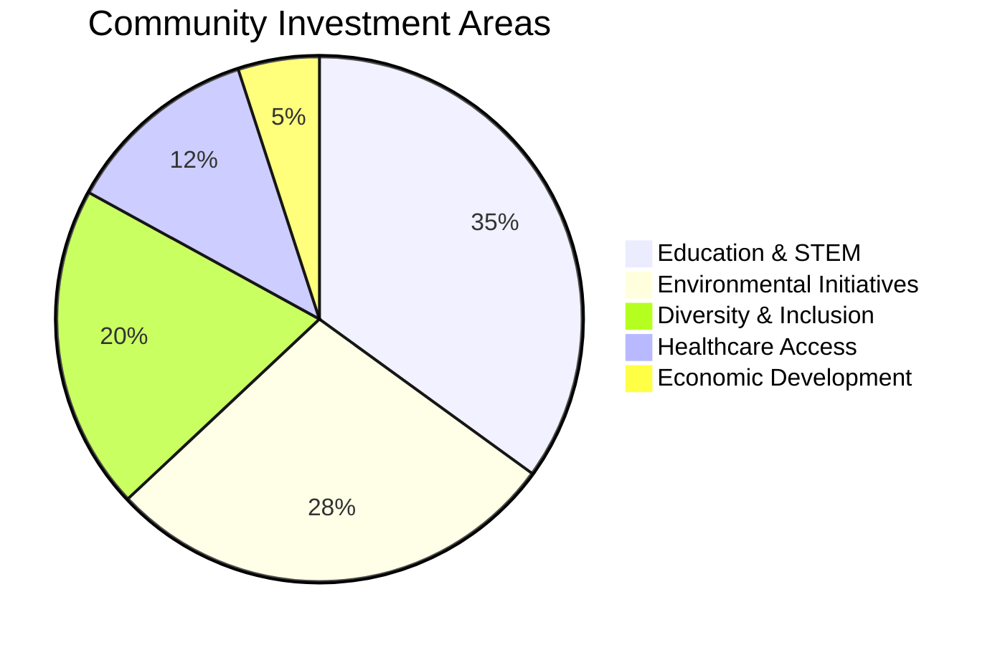
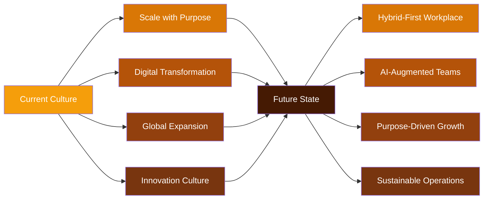

```json frontmatter
{
  "title": "Company Culture Showcase: People First, Always",
  "theme": {
    "mode": "light",
    "colors": {
      "light": {
        "primary": "#f59e0b",
        "secondary": "#d97706",
        "background": "#fefce8",
        "surface": "#ffffff",
        "text": "#92400e",
        "text-secondary": "#a16207"
      },
      "dark": {
        "primary": "#fbbf24",
        "secondary": "#f59e0b",
        "background": "#451a03",
        "surface": "#78350f",
        "text": "#fef3c7",
        "text-secondary": "#fde68a"
      }
    }
  },
  "navigation": {
    "order": [
      "our-story",
      "core-values",
      "diversity-inclusion",
      "employee-spotlight",
      "work-life-harmony",
      "growth-opportunities",
      "community-impact",
      "future-culture",
      "glossary"
    ]
  },
  "hero": {
    "title": "People First, Always",
    "subtitle": "Celebrating the heart and soul of our organization - the incredible people who make it all possible",
    "highlights": [
      {
        "metric": "Employee Satisfaction",
        "value": "96%",
        "label": "Globally recognized"
      },
      {
        "metric": "Diversity Score",
        "value": "98%",
        "label": "Inclusive excellence"
      },
      {
        "metric": "Retention Rate",
        "value": "94%",
        "label": "People choose to stay"
      }
    ],
    "callToActions": [
      {
        "text": "👥 Meet Our People",
        "link": "#employee-spotlight",
        "primary": true
      },
      {
        "text": "🌟 Our Values",
        "link": "#core-values",
        "primary": false
      },
      {
        "text": "🤝 Join Our Team",
        "link": "#growth-opportunities",
        "primary": false
      }
    ]
  },
  "glossary": [
    { "term": "Psychological Safety", "definition": "A workplace environment where employees feel safe to take risks, voice opinions, and admit mistakes without fear of negative consequences." },
    { "term": "Servant Leadership", "definition": "A leadership philosophy that prioritizes the growth, well-being, and success of team members above all else." },
    { "term": "Inclusive Culture", "definition": "An organizational environment where all employees feel valued, respected, and empowered to contribute their unique perspectives." },
    { "term": "Work-Life Integration", "definition": "The blending of professional and personal life in a way that supports both productivity and personal fulfillment." },
    { "term": "Growth Mindset", "definition": "The belief that abilities and intelligence can be developed through dedication, effort, and learning from experiences." }
  ]
}
```

## Our Story: From Startup to Global Family {#our-story}

What started as a small team of passionate innovators in a garage has grown into a global family of over 2,500 employees across 45 countries. Our journey isn't just about business success - it's about building something meaningful that brings out the best in everyone.

```kpi-grid
[
  { "label": "Years of Growth", "value": "12+" },
  { "label": "Countries", "value": "45" },
  { "label": "Team Members", "value": "2,500+" },
  { "label": "Offices", "value": "18" },
  { "label": "Languages Spoken", "value": "32" },
  { "label": "Time Zones", "value": "24/7" }
]
```

> Culture isn't just one aspect of the game - it is the game. In the end, an organization is nothing more than the collective capacity of its people to create value.
>
> — Lou Gerstner, Former CEO of IBM

## Our Core Values: The Foundation of Everything {#core-values}

Our values aren't just words on a wall - they're the principles that guide every decision, every interaction, and every innovation. They define who we are and what we stand for as an organization.

```mermaid
graph TD
    A[Our Values] --> B[People First]
    A --> C[Innovation with Purpose]
    A --> D[Inclusive Excellence]
    A --> E[Customer Obsession]
    A --> F[Sustainable Impact]

    B --> G[Empathy & Respect]
    B --> H[Personal Growth]
    B --> I[Work-Life Harmony]

    C --> J[Creative Problem Solving]
    C --> K[Continuous Learning]
    C --> L[Bold Experimentation]

    D --> M[Diversity & Inclusion]
    D --> N[Equity & Justice]
    D --> O[Global Mindset]

    E --> P[Customer Success]
    E --> Q[User Experience]
    E --> R[Feedback Culture]

    F --> S[Environmental Care]
    F --> T[Community Support]
    F --> U[Ethical Business]

    style A fill:#f59e0b,color:#fff
    style B fill:#d97706,color:#fff
    style C fill:#b45309,color:#fff
    style D fill:#92400e,color:#fff
    style E fill:#78350f,color:#fff
    style F fill:#451a03,color:#fff
```




## Diversity & Inclusion: Our Strength, Our Future {#diversity-inclusion}

We believe that diverse perspectives drive innovation and better solutions. Our commitment to inclusion goes beyond representation - it's about creating an environment where everyone can thrive and contribute their unique talents.

```mermaid
graph TD
    A[Diversity Initiatives] --> B[Inclusive Hiring]
    A --> C[Unconscious Bias Training]
    A --> D[Employee Resource Groups]
    A --> E[Mentorship Programs]
    A --> F[Accessibility Support]

    B --> G[Skills-Based Hiring]
    B --> H[Diverse Interview Panels]
    B --> I[Inclusive Job Descriptions]

    C --> J[Annual Training]
    C --> K[Bias Awareness Workshops]
    C --> L[Inclusive Leadership]

    D --> M[8 Active Groups]
    D --> N[Cross-Cultural Events]
    D --> O[Community Building]

    E --> P[Mentor Matching]
    E --> Q[Career Development]
    E --> R[Sponsorship Programs]

    F --> S[Universal Design]
    F --> T[Flexible Work]
    F --> U[Assistive Technology]

    style A fill:#f59e0b,color:#fff
    style B fill:#d97706,color:#fff
    style C fill:#b45309,color:#fff
    style D fill:#92400e,color:#fff
    style E fill:#78350f,color:#fff
    style F fill:#451a03,color:#fff
```





```kpi-grid
[
  { "label": "Women in Leadership", "value": "48%" },
  { "label": "Diverse Hiring Rate", "value": "94%" },
  { "label": "ERG Participation", "value": "78%" },
  { "label": "Inclusive Score", "value": "9.6/10" },
  { "label": "Bias Incident Rate", "value": "0.02%" },
  { "label": "Global Representation", "value": "85+" }
]
```

## Employee Spotlight: Celebrating Our People {#employee-spotlight}

Every day, our employees inspire us with their creativity, dedication, and passion. Here are just a few of the remarkable individuals who make our company special.

```mermaid
graph TD
    A[Employee Spotlight] --> B[Maria Rodriguez - Senior Engineer]
    A --> C[David Chen - Product Designer]
    A --> D[Sarah Johnson - Customer Success]
    A --> E[Ahmed Hassan - Data Scientist]
    A --> F[Linda Park - Marketing Lead]

    B --> G['Built our AI infrastructure from scratch']
    B --> H['Mentors 12 junior engineers']
    B --> I['Won 3 innovation awards']

    C --> J['Redesigned our entire user experience']
    C --> K['Led inclusive design initiatives']
    C --> L['Published 8 design system papers']

    D --> M['Achieved 98% customer satisfaction']
    D --> N['Trained 50+ customer success reps']
    D --> O['Created customer advocacy program']

    E --> P['Developed predictive analytics platform']
    E --> Q['Reduced costs by 40%']
    E --> R['PhD in Machine Learning']

    F --> S['Grew brand awareness by 300%']
    F --> T['Led diversity marketing campaigns']
    F --> U['Won 5 industry marketing awards']

    style A fill:#f59e0b,color:#fff
    style B fill:#d97706,color:#fff
    style C fill:#b45309,color:#fff
    style D fill:#92400e,color:#fff
    style E fill:#78350f,color:#fff
    style F fill:#451a03,color:#fff
```



> The most important thing I've learned is that you can't please everyone, but you can create an environment where everyone feels heard, valued, and empowered to do their best work.
>
> — Maria Rodriguez, Senior Engineer

> Design isn't just about making things look pretty - it's about creating experiences that make people feel included, capable, and inspired.
>
> — David Chen, Product Designer

## Work-Life Harmony: Thriving, Not Just Surviving {#work-life-harmony}

We believe that the best work happens when people have the freedom and support to live full, balanced lives. Our approach to work-life harmony isn't about work-life balance - it's about integration and flexibility.

```mermaid
graph TD
    A[Work-Life Harmony] --> B[Flexible Work]
    A --> C[Mental Health Support]
    A --> D[Parental Leave]
    A --> E[Professional Development]
    A --> F[Wellness Programs]

    B --> G[Remote-First Policy]
    B --> H[Flexible Hours]
    B --> I[Part-Time Options]

    C --> J[24/7 Counseling]
    C --> K[Mental Health Days]
    C --> L[Stress Management]

    D --> M[16 Weeks Paid Leave]
    D --> N[Secondary Caregiver Leave]
    D --> O[Adoption Support]

    E --> P[Learning Budget]
    E --> Q[Conference Attendance]
    E --> R[Professional Certifications]

    F --> S[Fitness Reimbursements]
    F --> T[Wellness Challenges]
    F --> U[Health Screenings]

    style A fill:#f59e0b,color:#fff
    style B fill:#d97706,color:#fff
    style C fill:#b45309,color:#fff
    style D fill:#92400e,color:#fff
    style E fill:#78350f,color:#fff
    style F fill:#451a03,color:#fff
```



```kpi-grid
[
  { "label": "Flexible Work Adoption", "value": "87%" },
  { "label": "Parental Leave Usage", "value": "94%" },
  { "label": "Mental Health Support", "value": "4.8/5" },
  { "label": "Learning & Development", "value": "$2,500/year" },
  { "label": "Wellness Participation", "value": "76%" },
  { "label": "Burnout Rate", "value": "2.1%" }
]
```


## Growth & Development: Investing in Our People {#growth-opportunities}

Growth isn't optional - it's essential. We provide comprehensive opportunities for professional development, career advancement, and personal growth that help our people reach their full potential.

```mermaid
graph TD
    A[Growth Framework] --> B[Career Development]
    A --> C[Skill Building]
    A --> D[Mentorship]
    A --> E[Leadership Development]
    A --> F[Internal Mobility]

    B --> G[Career Planning]
    B --> H[Performance Reviews]
    B --> I[Promotion Paths]

    C --> J[Online Learning]
    C --> K[Technical Training]
    C --> L[Soft Skills]

    D --> M[Mentor Matching]
    D --> N[Reverse Mentoring]
    D --> O[Executive Coaching]

    E --> P[Leadership Training]
    E --> Q[Management Programs]
    E --> R[Executive Development]

    F --> S[Job Rotation]
    F --> T[Internal Transfers]
    F --> U[Project Opportunities]

    style A fill:#f59e0b,color:#fff
    style B fill:#d97706,color:#fff
    style C fill:#b45309,color:#fff
    style D fill:#92400e,color:#fff
    style E fill:#78350f,color:#fff
    style F fill:#451a03,color:#fff
```



```kpi-grid
[
  { "label": "Training Completion", "value": "92%" },
  { "label": "Internal Promotions", "value": "68%" },
  { "label": "Mentorship Participation", "value": "84%" },
  { "label": "Skill Development", "value": "+45%" },
  { "label": "Leadership Pipeline", "value": "156 roles" },
  { "label": "Career Satisfaction", "value": "9.2/10" }
]
```

## Community Impact: Giving Back Together {#community-impact}

Our commitment to social responsibility extends beyond our company walls. We believe in using our resources, talents, and platform to create positive change in the communities where we live and work.

```mermaid
graph TD
    A[Community Impact] --> B[Employee Volunteer Program]
    A --> C[Philanthropic Giving]
    A --> D[Skill-Based Volunteering]
    A --> E[Partnership Programs]
    A --> F[Product Donations]

    B --> G[Paid Volunteer Time]
    B --> H[Team Building Events]
    B --> I[Global Days of Service]

    C --> J[Matching Donations]
    C --> K[Corporate Grants]
    C --> L[Emergency Relief]

    D --> M[Technical Mentoring]
    D --> N[Design Consulting]
    D --> O[Business Advisory]

    E --> P[Non-Profit Partnerships]
    E --> Q[Industry Alliances]
    E --> R[Government Programs]

    F --> S[Free Access Programs]
    F --> T[Educational Licenses]
    F --> U[Research Grants]

    style A fill:#f59e0b,color:#fff
    style B fill:#d97706,color:#fff
    style C fill:#b45309,color:#fff
    style D fill:#92400e,color:#fff
    style E fill:#78350f,color:#fff
    style F fill:#451a03,color:#fff
```





```kpi-grid
[
  { "label": "Volunteer Hours", "value": "25,000+" },
  { "label": "Community Partners", "value": "150+" },
  { "label": "Philanthropic Giving", "value": "$2.5M" },
  { "label": "STEM Students Reached", "value": "10,000+" },
  { "label": "Diversity Programs", "value": "25 initiatives" },
  { "label": "Impact Score", "value": "9.4/10" }
]
```

## Future Culture: Evolving Together {#future-culture}

As we grow and evolve, so does our culture. We're committed to maintaining the core values that have made us successful while adapting to new challenges and opportunities.



> The future of work isn't about where we work - it's about how we work together, learn together, and grow together. Culture is the foundation that will carry us forward.
>
> — Jennifer Walsh, Chief People Officer

## Culture & People Glossary {#glossary}

```glossary
```
