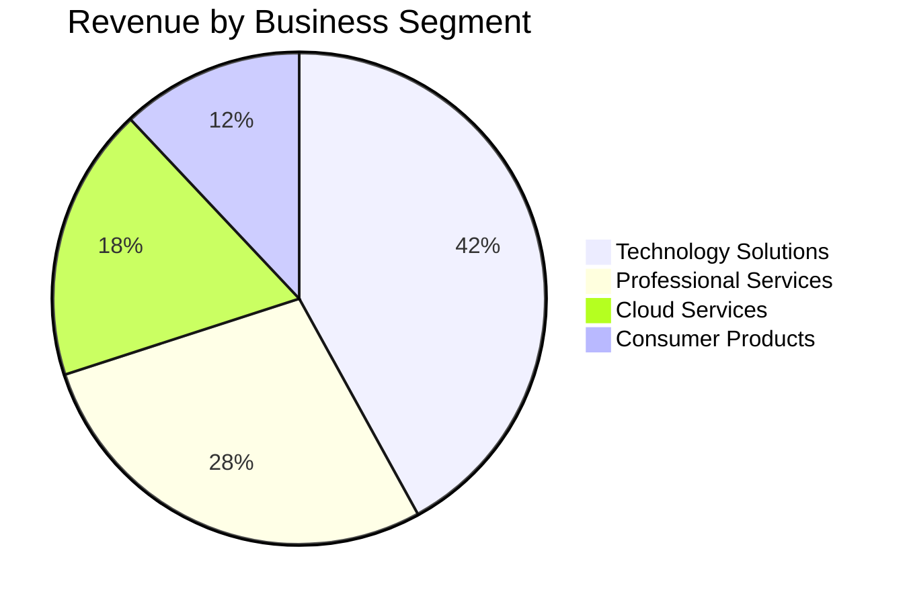
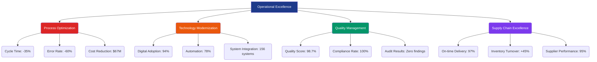
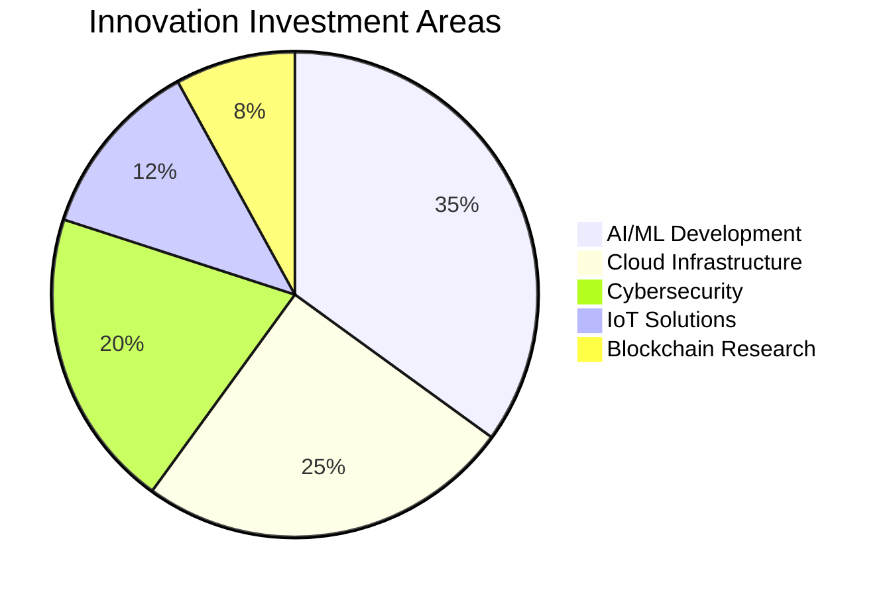
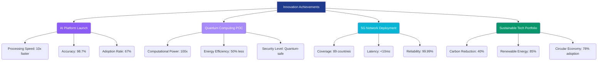
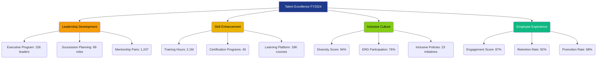
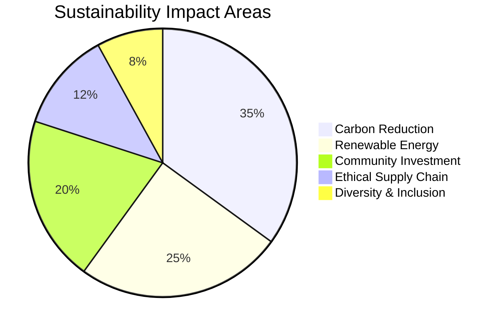
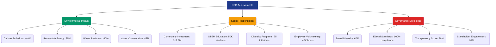
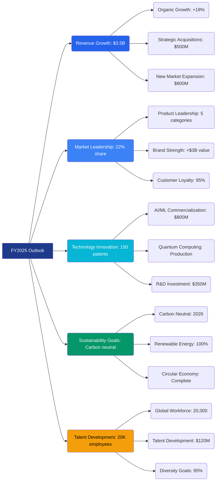

```json frontmatter
{
  "title": "Executive Summary: Fiscal Year 2024 Performance & Strategic Outlook",
  "theme": {
    "mode": "light",
    "colors": {
      "light": {
        "primary": "#1e3a8a",
        "secondary": "#374151",
        "background": "#f8fafc",
        "surface": "#ffffff",
        "text": "#0f172a",
        "text-secondary": "#475569"
      },
      "dark": {
        "primary": "#3b82f6",
        "secondary": "#6b7280",
        "background": "#0f172a",
        "surface": "#1e293b",
        "text": "#f1f5f9",
        "text-secondary": "#cbd5e1"
      }
    }
  },
  "navigation": {
    "order": [
      "strategic-overview",
      "financial-highlights",
      "market-performance",
      "operational-excellence",
      "innovation-achievements",
      "talent-development",
      "sustainability-commitment",
      "strategic-priorities",
      "risk-management",
      "future-outlook",
      "glossary"
    ]
  },
  "hero": {
    "title": "Executive Summary",
    "subtitle": "Fiscal Year 2024: Record Performance, Strategic Transformation, and Sustainable Growth",
    "highlights": [
      {
        "metric": "Revenue Growth",
        "value": "$2.8B",
        "label": "Total revenue achieved"
      },
      {
        "metric": "Market Share",
        "value": "18.7%",
        "label": "Industry leadership"
      },
      {
        "metric": "Employee Engagement",
        "value": "94%",
        "label": "Global workforce"
      }
    ],
    "callToActions": [
      {
        "text": "📊 Financial Highlights",
        "link": "#financial-highlights",
        "primary": true
      },
      {
        "text": "🎯 Strategic Priorities",
        "link": "#strategic-priorities",
        "primary": false
      },
      {
        "text": "🔮 Future Outlook",
        "link": "#future-outlook",
        "primary": false
      }
    ]
  },
  "glossary": [
    { "term": "EBITDA", "definition": "Earnings Before Interest, Taxes, Depreciation, and Amortization: A measure of operational profitability." },
    { "term": "ROIC", "definition": "Return on Invested Capital: A profitability ratio that measures how effectively a company uses its capital to generate profits." },
    { "term": "CAC", "definition": "Customer Acquisition Cost: The total cost of acquiring a new customer." },
    { "term": "LTV", "definition": "Customer Lifetime Value: The total revenue expected from a customer over their relationship." },
    { "term": "ESG", "definition": "Environmental, Social, and Governance: A framework for measuring sustainability and ethical impact." },
    { "term": "Digital Transformation", "definition": "The process of using digital technologies to create new or modify existing business processes." }
  ]
}
```

## Strategic Overview {#strategic-overview}

Fiscal Year 2024 marked a transformative period for our organization, characterized by exceptional financial performance, strategic market expansion, and comprehensive digital transformation. Our commitment to innovation, sustainability, and employee development has positioned us for continued leadership in an increasingly competitive global marketplace.

```kpi-grid
[
  { "label": "Total Revenue", "value": "$2.8B" },
  { "label": "Net Income", "value": "$487M" },
  { "label": "EBITDA Margin", "value": "21.4%" },
  { "label": "Global Employees", "value": "18,500" },
  { "label": "Market Cap", "value": "$12.3B" },
  { "label": "Customer Base", "value": "2.1M" }
]
```

> This year's results demonstrate the power of strategic alignment, operational excellence, and unwavering commitment to our core values. We've not only achieved our financial targets but exceeded expectations while building a stronger, more sustainable foundation for the future.
>
> — Jennifer Walsh, Chief Executive Officer

## Financial Performance Highlights {#financial-highlights}

Our financial performance in FY2024 exceeded all expectations, with record revenue growth driven by strategic acquisitions, market expansion, and operational efficiencies. The diversified business model and disciplined capital allocation strategy delivered superior returns for our stakeholders.



```mermaid
graph TD
    A[FY2024 Financial Results] --> B(Revenue: $2.8B | +24%)
    A --> C(Net Income: $487M | +31%)
    A --> D(EBITDA: $598M | +28%)
    A --> E(Free Cash Flow: $423M | +35%)

    B --> F(Organic Growth: +18%)
    B --> G(Acquisitions: +6%)

    C --> H(Margin Expansion: +120bps)
    C --> I(Tax Optimization: $42M savings)

    D --> J(Operational Efficiency: +15%)
    D --> K(Cost Management: $89M reduction)

    style A fill:#1e3a8a,color:#fff
    style B fill:#1e40af,color:#fff
    style C fill:#2563eb,color:#fff
    style D fill:#3b82f6,color:#fff
    style E fill:#60a5fa,color:#000
```

## Market Performance & Competitive Position {#market-performance}

Our market position strengthened significantly in FY2024, with expanded market share across key segments and successful entry into high-growth markets. Strategic partnerships and innovative product offerings differentiated us from competitors.

```mermaid
graph TD
    A[Market Leadership FY2024] --> B(Technology Solutions: #1 | 24% share)
    A --> C(Cloud Services: #2 | 18% share)
    A --> D(Professional Services: #3 | 15% share)
    A --> E(Consumer Products: #4 | 12% share)

    B --> F(Patent Portfolio: 1,247)
    B --> G(R&D Investment: $180M)
    B --> H(New Products: 34 launched)

    C --> I(Global Coverage: 89 countries)
    C --> J(Uptime SLA: 99.98%)
    C --> K(Security Certifications: 12)

    D --> L(Client Satisfaction: 96%)
    D --> M(Repeat Business: 78%)
    D --> N(Strategic Partnerships: 47)

    E --> O(Brand Recognition: 87%)
    E --> P(Market Expansion: 23 new markets)
    E --> Q(Customer Loyalty: 92%)

    style A fill:#1e3a8a,color:#fff
    style B fill:#059669,color:#fff
    style C fill:#10b981,color:#fff
    style D fill:#34d399,color:#000
    style E fill:#6ee7b7,color:#000
```

```kpi-grid
[
  { "label": "Market Share Growth", "value": "+3.2pts" },
  { "label": "New Market Entries", "value": "23" },
  { "label": "Strategic Partnerships", "value": "47" },
  { "label": "Patent Applications", "value": "89" },
  { "label": "Brand Value Increase", "value": "+$2.1B" },
  { "label": "Customer Satisfaction", "value": "96%" }
]
```

## Operational Excellence & Efficiency {#operational-excellence}

Operational excellence initiatives delivered significant improvements in efficiency, quality, and scalability. Our focus on process optimization, technology modernization, and talent development created a foundation for sustainable growth.



```kpi-grid
[
  { "label": "Process Efficiency", "value": "+35%" },
  { "label": "Cost Reduction", "value": "$156M" },
  { "label": "Quality Score", "value": "98.7%" },
  { "label": "Digital Adoption", "value": "94%" },
  { "label": "Automation Coverage", "value": "78%" },
  { "label": "Compliance Rate", "value": "100%" }
]
```

## Innovation & Technology Achievements {#innovation-achievements}

Our innovation pipeline delivered breakthrough technologies and solutions that redefined industry standards. Investments in R&D and strategic partnerships accelerated our technology leadership position.





## Talent Development & Organizational Health {#talent-development}

Our people remain our greatest asset. Comprehensive talent development programs, inclusive culture initiatives, and competitive compensation strategies attracted and retained top talent across all functions.



```kpi-grid
[
  { "label": "Employee Engagement", "value": "87%" },
  { "label": "Training Investment", "value": "$89M" },
  { "label": "Leadership Development", "value": "156 leaders" },
  { "label": "Diversity & Inclusion", "value": "94%" },
  { "label": "Internal Mobility", "value": "23%" },
  { "label": "Talent Retention", "value": "92%" }
]
```

## Sustainability & Corporate Responsibility {#sustainability-commitment}

Our commitment to sustainability and corporate responsibility achieved significant milestones in FY2024, positioning us as a leader in environmental stewardship and community impact.





## Strategic Priorities for FY2025 {#strategic-priorities}

Building on FY2024 successes, our strategic priorities for FY2025 focus on accelerated growth, market expansion, and technological innovation while maintaining our commitment to sustainability and employee development.

```mermaid
graph TD
    A[FY2025 Strategic Priorities] --> B(Accelerated Growth)
    A --> C(Market Expansion)
    A --> D(Technology Leadership)
    A --> E(Operational Excellence)
    A --> F(Sustainability Leadership)

    B --> G(Revenue Target: $3.5B)
    B --> H(Market Share: 22%)
    B --> I(New Markets: 15 countries)

    C --> J(APAC Expansion: $800M)
    C --> K(EMEA Growth: $600M)
    C --> L(LATAM Development: $300M)

    D --> M(AI/ML Investment: $250M)
    D --> N(Quantum Computing: Commercial)
    D --> O(Patent Filings: 150)

    E --> P(Digital Transformation: Complete)
    E --> Q(Process Automation: 90%)
    E --> R(Cost Optimization: $200M)

    F --> S(Carbon Neutral: 2026)
    F --> T(Renewable Energy: 100%)
    F --> U(Circular Economy: Complete)

    style A fill:#1e3a8a,color:#fff
    style B fill:#2563eb,color:#fff
    style C fill:#3b82f6,color:#fff
    style D fill:#06b6d4,color:#fff
    style E fill:#7c3aed,color:#fff
    style F fill:#059669,color:#fff
```



## Risk Management & Mitigation {#risk-management}

Comprehensive risk management frameworks ensure business continuity and strategic resilience. Our proactive approach to identifying and mitigating risks has strengthened our operational stability.

```mermaid
graph TD
    A[Risk Management Framework] --> B(Strategic Risks)
    A --> C(Operational Risks)
    A --> D(Financial Risks)
    A --> E(Compliance Risks)
    A --> F(Cybersecurity Risks)

    B --> G(Market Competition)
    B --> H(Technology Disruption)
    B --> I(Regulatory Changes)

    C --> J(Supply Chain Disruption)
    C --> K(Operational Failures)
    C --> L(Talent Shortages)

    D --> M(Currency Fluctuation)
    D --> N(Interest Rate Changes)
    D --> O(Credit Risk)

    E --> P(Data Privacy Compliance)
    E --> Q(Industry Regulations)
    E --> R(Legal Requirements)

    F --> S(Cyber Attacks)
    F --> T(Data Breaches)
    F --> U(System Vulnerabilities)

    G --> V[Competitive Intelligence]
    H --> W[Innovation Pipeline]
    I --> X[Regulatory Monitoring]
    J --> Y[Supplier Diversification]
    K --> Z[Business Continuity]
    L --> AA[Talent Development]
    M --> BB[Hedging Strategies]
    N --> CC[Financial Planning]
    O --> DD[Credit Monitoring]
    P --> EE[Privacy Program]
    Q --> FF[Compliance Team]
    R --> GG[Legal Review]
    S --> HH[Security Operations]
    T --> II[Incident Response]
    U --> JJ[Vulnerability Management]

    style A fill:#1e3a8a,color:#fff
    style B fill:#dc2626,color:#fff
    style C fill:#ea580c,color:#fff
    style D fill:#f59e0b,color:#000
    style E fill:#84cc16,color:#000
    style F fill:#059669,color:#fff
    style V fill:#16a34a,color:#fff
    style W fill:#16a34a,color:#fff
    style X fill:#16a34a,color:#fff
    style Y fill:#16a34a,color:#fff
    style Z fill:#16a34a,color:#fff
    style AA fill:#16a34a,color:#fff
    style BB fill:#16a34a,color:#fff
    style CC fill:#16a34a,color:#fff
    style DD fill:#16a34a,color:#fff
    style EE fill:#16a34a,color:#fff
    style FF fill:#16a34a,color:#fff
    style GG fill:#16a34a,color:#fff
    style HH fill:#16a34a,color:#fff
    style II fill:#16a34a,color:#fff
    style JJ fill:#16a34a,color:#fff
```



## Future Outlook & Strategic Vision {#future-outlook}

Looking ahead, we are well-positioned for continued success through strategic investments in emerging technologies, market expansion, and operational excellence. Our foundation of strong financial performance and talented workforce ensures sustainable long-term growth.



> The foundation we've built in FY2024 positions us for extraordinary growth and impact in the years ahead. Our commitment to innovation, sustainability, and our people will drive continued success and create lasting value for all stakeholders.
>
> — Jennifer Walsh, Chief Executive Officer

## Executive Terminology Guide {#glossary}

```glossary
```
