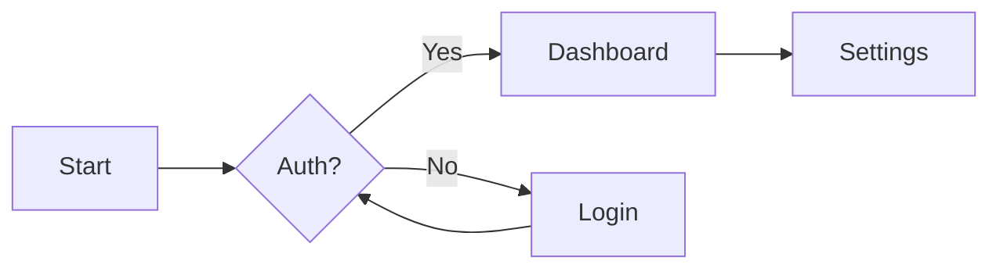
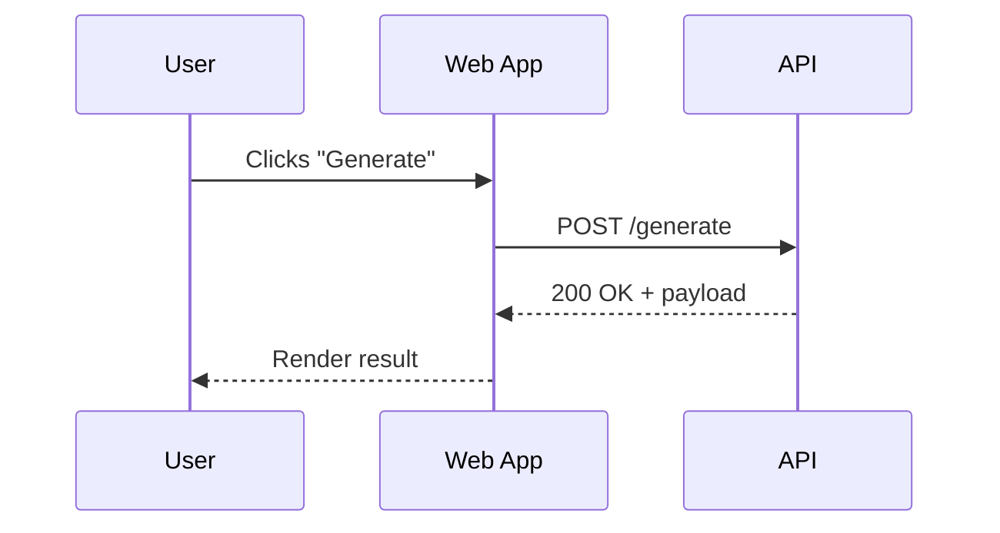
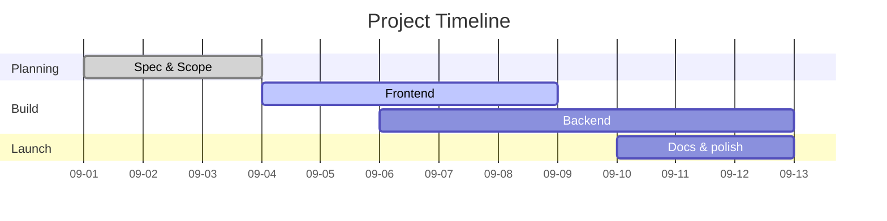
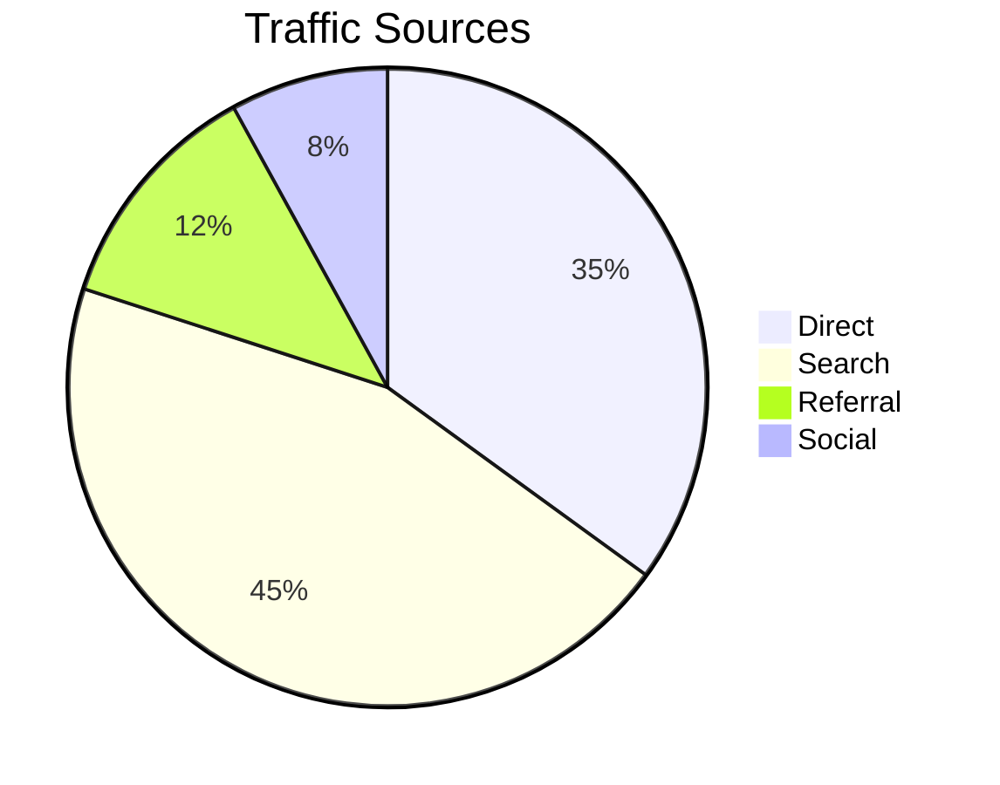

```json frontmatter
{
  "title": "Narrative Presentation - Full Feature Showcase",
  "theme": {
    "mode": "light",
    "colors": {
      "light": {
        "primary": "#7c3aed",
        "secondary": "#64748b",
        "background": "#ffffff",
        "surface": "#f8fafc",
        "text": "#0f172a",
        "text-secondary": "#64748b"
      },
      "dark": {
        "primary": "#a78bfa",
        "secondary": "#94a3b8",
        "background": "#0f172a",
        "surface": "#1e293b",
        "text": "#f8fafc",
        "text-secondary": "#cbd5e1"
      }
    }
  },
  "hero": {
    "title": "Full Feature Showcase",
    "subtitle": "A single deck that demonstrates JSON front matter, Markdown features, Mermaid diagrams, glossary tooltips, KPI grids, and navigation controls",
    "highlights": [
      { "metric": "Features", "value": "20+", "label": "Covered in one file" },
      { "metric": "Local", "value": "100%", "label": "No servers required" },
      { "metric": "Formats", "value": "JSON + MD", "label": "Dual authoring" }
    ],
    "callToActions": [
      { "text": "Start with Markdown", "link": "#markdown", "primary": true },
      { "text": "Jump to Diagrams", "link": "#diagrams", "primary": false }
    ]
  },
  "navigation": {
    "mode": "ordered",
    "order": ["intro", "markdown", "admonitions", "kpis", "diagrams", "glossary"]
  },
  "mermaid": {
    "config": {
      "flowchart": { "curve": "basis", "nodeSpacing": 70, "rankSpacing": 80 },
      "sequence":  { "diagramMarginX": 60, "diagramMarginY": 20 },
      "gantt":     { "barHeight": 28, "barGap": 10, "topPadding": 60, "leftPadding": 120, "axisFormat": "%m-%d" },
      "themeVariables": {
        "fontSize": "16px",
        "primaryColor": "#2563eb",
        "primaryTextColor": "#1a1a1a"
      }
    },
    "perChartDefaults": {
      "gantt": { "axisFormat": "%m-%d" }
    }
  },
  "glossary": [
    { "term": "KPI", "definition": "Key Performance Indicator. A measurable value that demonstrates how effectively objectives are being achieved." },
    { "term": "OKR", "definition": "Objectives and Key Results. A framework for defining and tracking objectives and their outcomes." },
    { "term": "Flowchart", "definition": "A diagram that represents a workflow or process." },
    { "term": "Gantt", "definition": "A type of bar chart that illustrates a project schedule." }
  ]
}
```

## Introduction {#intro}
Welcome to the **Full Feature Showcase**. This deck is authored in Markdown with JSON front matter and renders locally. External links like [OpenAI](https://www.openai.com) open in a new tab. Internal links like [Mermaid Diagrams](#diagrams) scroll within the page.  
You will see OKR and KPI used throughout to demo live glossary tooltips.

> Regular blockquote sample. This one is not an admonition, it is just a simple quote paragraph.

---

## Markdown Basics {#markdown}

**Inline styles:** _italic_, **bold**, ~~strikethrough~~, `inline code`.

**Lists:**

- Top level bullet
  - Nested bullet with `code`
  - Another nested bullet
- Second top level bullet

1. Ordered item one
2. Ordered item two
   1. Nested ordered item
   2. Another nested one

**Table:**

| Feature | Status | Notes |
| --- | --- | --- |
| JSON front matter | ✅ | Title, theme, hero, navigation, mermaid, glossary |
| Markdown tokens | ✅ | Headings, lists, tables, code, images |
| External links | ✅ | target="_blank" rel="noopener" |

**Code block:**

```js
function hello(name) {
  return `Hello, ${name}!`;
}
console.log(hello("world"));
```

**Image with caption:**


---

## Admonitions {#admonitions}

> [!NOTE]: Notes look like this
> Notes are for neutral info blocks. You can include lists and `code`.
>
> - Supports full Markdown
> - Renders as a themed callout

> [!TIP]: Tips highlight helpful context
> Keep sections concise for readability, use subsections for details.

> [!WARN]: Warnings communicate risk
> Validate your data before presenting results.

> [!QUOTE]: Quoted
> “Simplicity is the soul of efficiency.”

---

## KPI Grid {#kpis}

```kpi-grid
[
  { "label": "Monthly Revenue", "value": "$42,700" },
  { "label": "New Customers", "value": "318" },
  { "label": "Activation Rate", "value": "72.4%" },
  { "label": "NPS", "value": "57" },
  { "label": "Avg. Order Value", "value": "$86.10" },
  { "label": "Churn", "value": "2.1%" }
]
```

Long values and labels wrap cleanly. They are clamped to two lines. KPI and OKR terms in this text will trigger tooltips.

---

## Mermaid Diagrams {#diagrams}

### Flowchart {#flowchart}



### Sequence {#sequence}



### Gantt {#gantt}



### Pie {#pie}



---

## Glossary {#glossary}

Use of OKR and KPI across sections produces in-line tooltips. You can also insert the full glossary list where needed:

[[glossary]]

Or via a dedicated block:

```glossary
```
