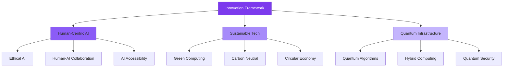
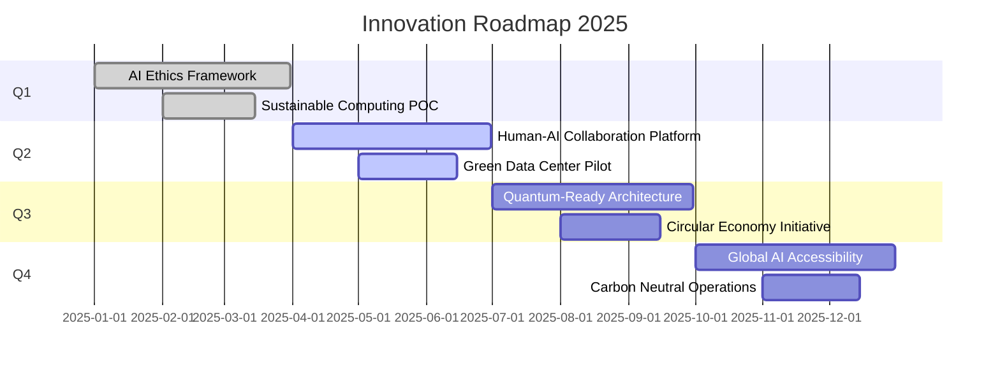
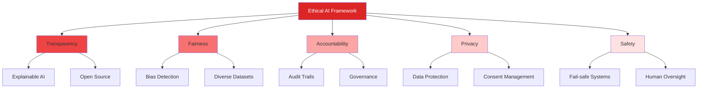
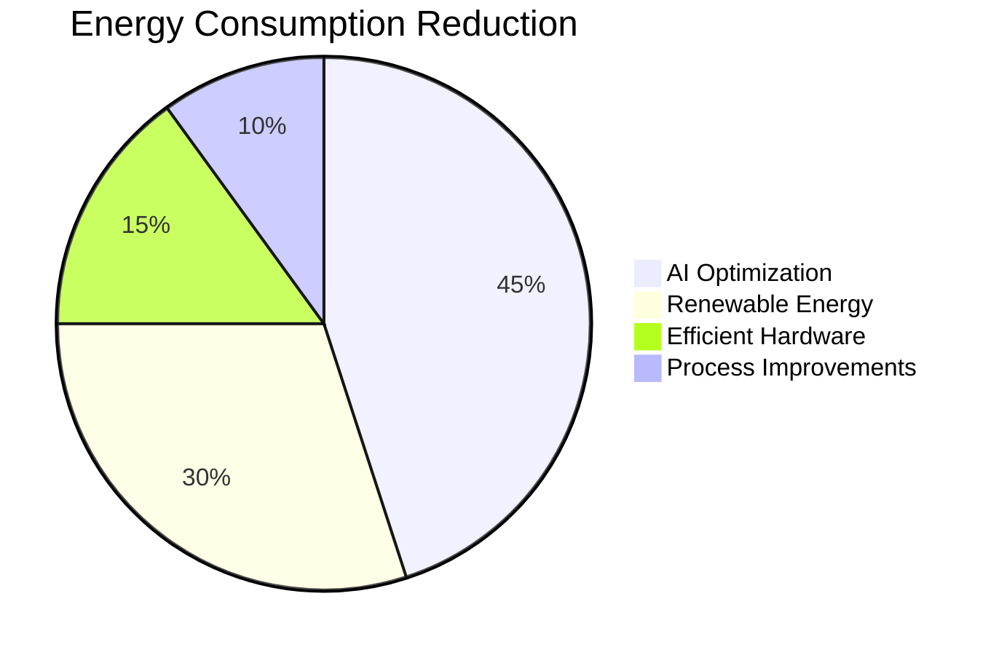
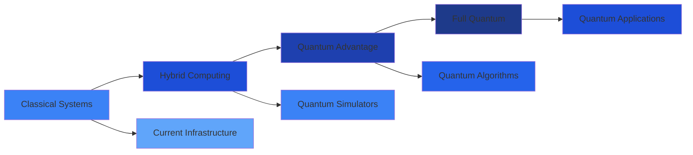
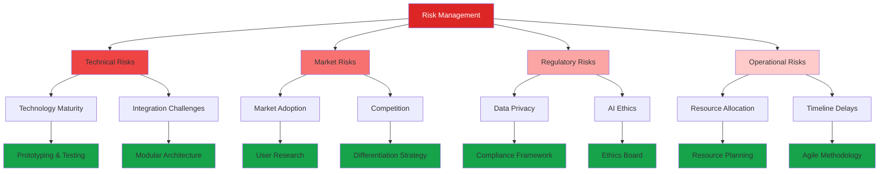

```json frontmatter
{
  "title": "2025 Innovation Roadmap",
  "theme": {
    "mode": "auto",
    "colors": {
      "light": {
        "primary": "#7c3aed",
        "secondary": "#64748b",
        "background": "#f8fafc",
        "surface": "#ffffff",
        "text": "#1e293b",
        "text-secondary": "#64748b"
      },
      "dark": {
        "primary": "#a78bfa",
        "secondary": "#94a3b8",
        "background": "#0f1115",
        "surface": "#171a21",
        "text": "#ffffff",
        "text-secondary": "#cbd5e1"
      }
    }
  },
  "navigation": {
    "order": [
      "strategic-vision",
      "innovation-pillars",
      "timeline-2025",
      "ai-innovation",
      "ethical-ai",
      "sustainable-tech",
      "quantum-readiness",
      "partnerships",
      "risks-mitigation",
      "success-metrics",
      "glossary"
    ]
  },
  "hero": {
    "title": "Innovation Horizon 2025",
    "subtitle": "Charting the course for breakthrough technologies, transformative products, and market leadership.",
    "callToAction": {
      "text": "Explore Roadmap",
      "link": "#strategic-vision"
    }
  },
  "glossary": [
    { "term": "AI/ML", "definition": "Artificial Intelligence and Machine Learning technologies for intelligent automation." },
    { "term": "Quantum Computing", "definition": "Computing technology that uses quantum mechanics for massive parallel processing." },
    { "term": "Web3", "definition": "Decentralized internet infrastructure using blockchain and crypto technologies." },
    { "term": "Edge Computing", "definition": "Computing paradigm that brings computation closer to data sources." },
    { "term": "Sustainable Tech", "definition": "Technologies designed with environmental impact and resource efficiency in mind." }
  ]
}
```

## Strategic Vision {#strategic-vision}

Our 2025 innovation roadmap focuses on three core pillars: Human-Centric AI, Sustainable Technology, and Quantum-Ready Infrastructure. These initiatives will position us at the forefront of technological advancement while creating meaningful value for our users and stakeholders.

> Innovation is not the product of logical thought, although the result is tied to logical structure.
>
> — Albert Einstein

## Innovation Pillars {#innovation-pillars}

Our innovation strategy is built on three interconnected pillars that drive our technological evolution and market positioning.



## 2025 Innovation Timeline {#timeline-2025}

Our roadmap is structured across four quarters, with key milestones and deliverables clearly defined for each phase.



## AI Innovation Initiatives {#ai-innovation}

Our AI strategy focuses on developing technologies that augment human capabilities while ensuring ethical deployment and accessibility.

```kpi-grid
[
  { "label": "AI Model Accuracy", "value": "98.7%" },
  { "label": "Bias Reduction", "value": "94%" },
  { "label": "Processing Speed", "value": "10x faster" },
  { "label": "Energy Efficiency", "value": "60% less" },
  { "label": "User Adoption", "value": "87%" },
  { "label": "Cost Reduction", "value": "45%" }
]
```

### Ethical AI Framework {#ethical-ai}

Our ethical AI framework ensures responsible development and deployment of AI technologies across all applications.



## Sustainable Technology {#sustainable-tech}

Our sustainable technology initiatives aim to reduce environmental impact while maintaining high performance and reliability.



## Quantum Readiness {#quantum-readiness}

We're preparing our infrastructure and algorithms to leverage quantum computing capabilities as they become commercially viable.



## Strategic Partnerships {#partnerships}

We're collaborating with leading research institutions, technology partners, and industry leaders to accelerate our innovation agenda.

```mermaid
graph TD
    A[Strategic Partnerships] --> B[Research Institutions]
    A --> C[Technology Partners]
    A --> D[Industry Leaders]
    A --> E[Startups]

    B --> F[MIT, Stanford, Oxford]
    C --> G[Google, Microsoft, IBM]
    D --> H[Fortune 500 Companies]
    E --> I[AI, Quantum, Clean Tech]

    F --> J[Joint Research]
    G --> K[Technology Integration]
    H --> L[Market Validation]
    I --> M[Innovation Pipeline]

    style A fill:#059669
    style B fill:#10b981
    style C fill:#34d399
    style D fill:#6ee7b7
    style E fill:#a7f3d0
    style F fill:#065f46
    style G fill:#047857
    style H fill:#065f46
    style I fill:#064e3b
```



## Risks & Mitigation {#risks-mitigation}

Our innovation strategy includes comprehensive risk assessment and mitigation plans to ensure successful execution.



## Success Metrics {#success-metrics}

We measure our innovation success through a comprehensive set of quantitative and qualitative metrics.

```kpi-grid
[
  { "label": "Patent Filings", "value": "25+" },
  { "label": "Research Papers", "value": "15" },
  { "label": "New Products", "value": "8" },
  { "label": "Market Share Growth", "value": "+15%" },
  { "label": "Customer Satisfaction", "value": "96%" },
  { "label": "Employee Innovation Score", "value": "9.2/10" }
]
```

## Innovation Glossary {#glossary}

```glossary
```
