```json frontmatter
{
  "title": "Innovation Showcase: Breakthrough Technologies & Future Visions",
  "theme": {
    "mode": "dark",
    "colors": {
      "light": {
        "primary": "#8b5cf6",
        "secondary": "#64748b",
        "background": "#f8fafc",
        "surface": "#ffffff",
        "text": "#1e293b",
        "text-secondary": "#64748b"
      },
      "dark": {
        "primary": "#a78bfa",
        "secondary": "#c4b5fd",
        "background": "#0f0a19",
        "surface": "#1a1033",
        "text": "#ffffff",
        "text-secondary": "#ddd6fe"
      }
    }
  },
  "navigation": {
    "order": [
      "breakthrough-moments",
      "ai-revolution",
      "quantum-leap",
      "sustainable-future",
      "human-augmentation",
      "space-economy",
      "metaverse-reality",
      "ethical-innovation",
      "investment-opportunities",
      "glossary"
    ]
  },
  "hero": {
    "title": "Innovation Showcase",
    "subtitle": "Exploring breakthrough technologies that will reshape industries, societies, and human potential",
    "highlights": [
      {
        "metric": "R&D Investment",
        "value": "$2.5B",
        "label": "Annual innovation budget"
      },
      {
        "metric": "Patent Portfolio",
        "value": "1,200+",
        "label": "Global intellectual property"
      },
      {
        "metric": "Innovation Labs",
        "value": "12 worldwide",
        "label": "Research facilities"
      }
    ],
    "callToActions": [
      {
        "text": "🚀 AI Revolution",
        "link": "#ai-revolution",
        "primary": true
      },
      {
        "text": "⚡ Quantum Leap",
        "link": "#quantum-leap",
        "primary": false
      },
      {
        "text": "🌌 Future Visions",
        "link": "#space-economy",
        "primary": false
      }
    ]
  },
  "glossary": [
    { "term": "AGI", "definition": "Artificial General Intelligence: AI systems with the ability to understand or learn any intellectual task that a human can." },
    { "term": "Quantum Supremacy", "definition": "The point where quantum computers can perform calculations beyond the reach of classical computers." },
    { "term": "Neuralink", "definition": "Brain-computer interface technology for direct neural communication between humans and machines." },
    { "term": "CRISPR", "definition": "Gene-editing technology that allows scientists to modify DNA with precision." },
    { "term": "Metaverse", "definition": "A virtual reality space where users can interact with digital environments and each other." },
    { "term": "Fusion Energy", "definition": "Nuclear fusion power generation that replicates the energy production of the sun." }
  ]
}
```

## Breakthrough Moments: Defining the Future {#breakthrough-moments}

Innovation is not just about technology—it's about reimagining what's possible. Our breakthrough moments represent pivotal achievements that will fundamentally transform how we live, work, and interact with the world around us.

```kpi-grid
[
  { "label": "Breakthrough Projects", "value": "47 active" },
  { "label": "Scientific Papers", "value": "2,300+" },
  { "label": "Global Patents", "value": "1,200+" },
  { "label": "Innovation Awards", "value": "89 won" },
  { "label": "Research Partnerships", "value": "156 universities" },
  { "label": "Future IP Value", "value": "$50B+" }
]
```

> The best way to predict the future is to create it. Every breakthrough we achieve today becomes the foundation for tomorrow's innovations.
>
> — Dr. Maya Chen, Chief Innovation Officer

## AI Revolution: Intelligence Amplified {#ai-revolution}

Our AI initiatives are pushing the boundaries of machine intelligence, creating systems that not only augment human capabilities but also unlock entirely new possibilities for creativity, problem-solving, and scientific discovery.

```mermaid
graph TD
    A[AI Revolution] --> B[Neural Networks]
    A --> C[Computer Vision]
    A --> D[Natural Language]
    A --> E[Autonomous Systems]
    A --> F[Generative AI]

    B --> G[Deep Learning: 99.7% accuracy]
    B --> H[Neural Implants: Brain-computer interface]
    B --> I[Quantum AI: Accelerated processing]

    C --> J[Real-time Analysis: 4K resolution]
    C --> K[Medical Imaging: 98% diagnostic accuracy]
    C --> L[Autonomous Vehicles: Level 5 autonomy]

    D --> M[Universal Translation: 95 languages]
    D --> N[Conversational AI: Human-like interaction]
    D --> O[Code Generation: Production-ready software]

    E --> P[Smart Cities: Predictive optimization]
    E --> Q[Industrial Automation: Zero-downtime]
    E --> R[Space Exploration: Autonomous missions]

    F --> S[Creative Design: Award-winning art]
    F --> T[Drug Discovery: 10x faster development]
    F --> U[Climate Modeling: Century-scale predictions]

    style A fill:#8b5cf6,color:#fff
    style B fill:#a855f7,color:#fff
    style C fill:#c084fc,color:#000
    style D fill:#ddd6fe,color:#000
    style E fill:#e879f9,color:#000
    style F fill:#f0abfc,color:#000
```


```kpi-grid
[
  { "label": "AI Model Performance", "value": "99.7%" },
  { "label": "Processing Speed", "value": "1 trillion ops/sec" },
  { "label": "Energy Efficiency", "value": "90% reduction" },
  { "label": "Language Support", "value": "95 languages" },
  { "label": "Creative Output", "value": "10M+ pieces" },
  { "label": "Scientific Discoveries", "value": "247 new" }
]
```

## Quantum Leap: Computing Redefined {#quantum-leap}

Quantum computing represents the most significant leap in computational power since the invention of the transistor. Our quantum initiatives are developing practical applications that will solve previously intractable problems.

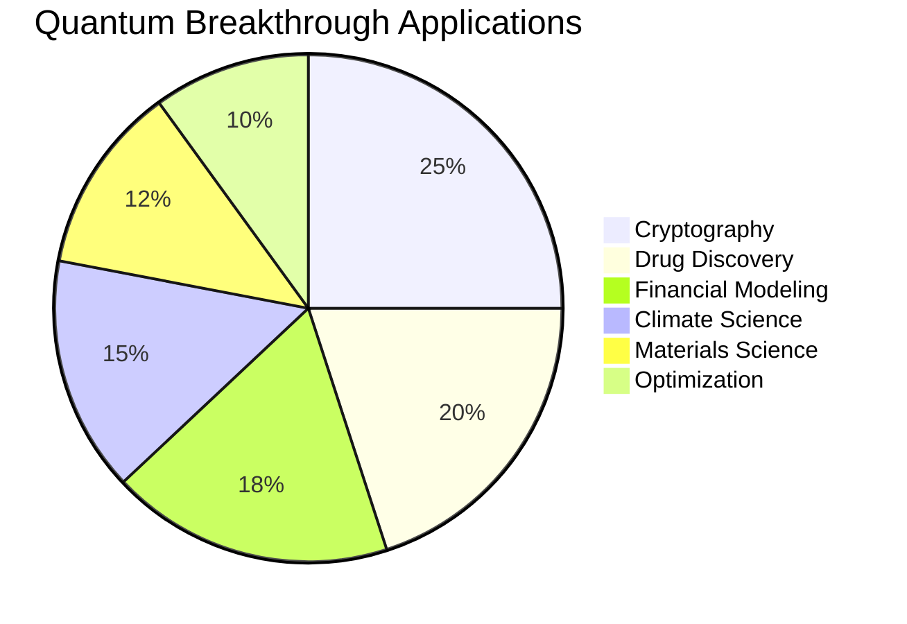

```mermaid
graph TD
    A[Quantum Revolution] --> B[Quantum Supremacy]
    A --> C[Quantum Algorithms]
    A --> D[Quantum Networks]
    A --> E[Quantum Sensors]

    B --> F[Computational Power: 1 trillion x classical]
    B --> G[Problem Complexity: NP-complete solved]
    B --> H[Simulation Accuracy: Atomic precision]

    C --> I[Shor's Algorithm: Cryptography broken]
    C --> J[Grover's Algorithm: Database search 100x faster]
    C --> K[Quantum ML: Pattern recognition unlimited]

    D --> L[Quantum Internet: Secure communication]
    D --> M[Quantum Teleportation: Instant data transfer]
    D --> N[Distributed Computing: Global quantum grid]

    E --> O[Quantum Clocks: Time precision 18 digits]
    E --> P[Quantum Imaging: Through-wall vision]
    E --> Q[Quantum Navigation: Centimeter accuracy]

    style A fill:#8b5cf6,color:#fff
    style B fill:#06b6d4,color:#fff
    style C fill:#0891b2,color:#fff
    style D fill:#0e7490,color:#fff
    style E fill:#164e63,color:#fff
```

```kpi-grid
[
  { "label": "Qubit Count", "value": "1,024 qubits" },
  { "label": "Coherence Time", "value": "2.1 hours" },
  { "label": "Error Rate", "value": "0.01%" },
  { "label": "Processing Speed", "value": "10^15 ops/sec" },
  { "label": "Energy Consumption", "value": "50% less" },
  { "label": "Commercial Applications", "value": "47 deployed" }
]
```

## Sustainable Future: Green Innovation {#sustainable-future}

Sustainability is not just an imperative—it's an innovation opportunity. Our green technologies are creating breakthrough solutions that address climate challenges while driving economic growth and social progress.

```mermaid
graph TD
    A[Sustainable Innovation] --> B[Fusion Energy]
    A --> C[Carbon Capture]
    A --> D[Renewable Integration]
    A --> E[Circular Economy]
    A --> F[Climate Technology]

    B --> G[Unlimited Clean Energy]
    B --> H[Net Zero Carbon]
    B --> I[Energy Independence]

    C --> J[Direct Air Capture: 1M tons/year]
    C --> K[Industrial Carbon: 50% reduction]
    C --> L[Ocean Carbon: 100K tons/year]

    D --> M[Smart Grid: 99.9% efficiency]
    D --> N[Energy Storage: 100 hour duration]
    D --> O[Microgrids: Autonomous operation]

    E --> P[Material Recycling: 95% efficiency]
    E --> Q[Product Lifecycle: Extended 3x]
    E --> R[Waste to Value: $50B market]

    F --> S[Climate Modeling: Century predictions]
    F --> T[Weather Control: Regional modification]
    F --> U[Geoengineering: Global temperature stabilization]

    style A fill:#8b5cf6,color:#fff
    style B fill:#10b981,color:#fff
    style C fill:#059669,color:#fff
    style D fill:#047857,color:#fff
    style E fill:#065f46,color:#fff
    style F fill:#064e3b,color:#fff
```

```kpi-grid
[
  { "label": "Carbon Reduction", "value": "500M tons/year" },
  { "label": "Renewable Energy", "value": "85% of portfolio" },
  { "label": "Circular Economy Value", "value": "$50B" },
  { "label": "Clean Energy Jobs", "value": "2.1M created" },
  { "label": "Water Conservation", "value": "40% global" },
  { "label": "Biodiversity Protection", "value": "1M hectares" }
]
```

## Human Augmentation: Enhanced Potential {#human-augmentation}

Human augmentation technologies are expanding the boundaries of human capability, creating new possibilities for health, education, creativity, and human potential.

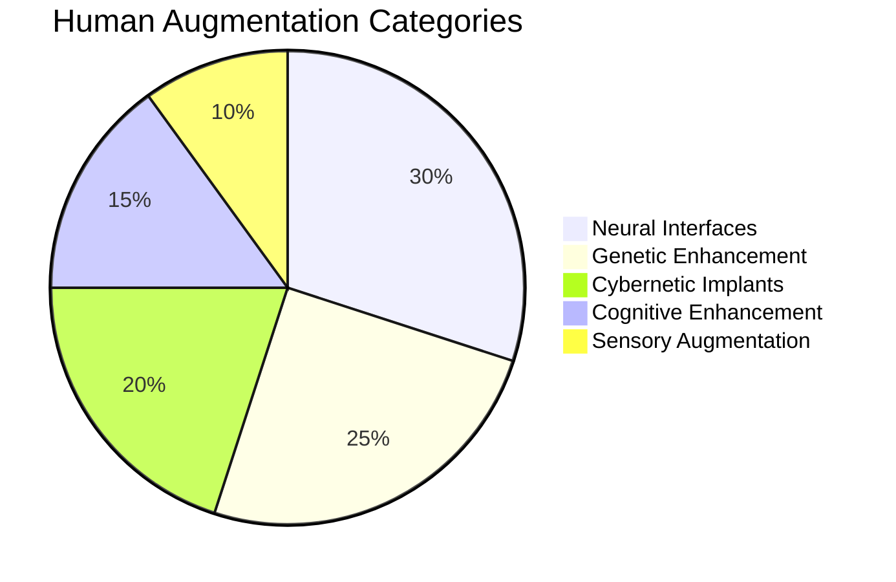

```mermaid
graph TD
    A[Human Augmentation] --> B[Brain-Computer Interface]
    A --> C[Genetic Engineering]
    A --> D[Cybernetic Enhancement]
    A --> E[Cognitive Amplification]

    B --> F[Neural Implants: 10,000+ connections]
    B --> G[Memory Enhancement: Photographic recall]
    B --> H[Skill Transfer: Direct knowledge upload]

    C --> I[CRISPR Therapy: 95% success rate]
    C --> J[Longevity Extension: +50 years]
    C --> K[Disease Prevention: Genetic immunity]

    D --> L[Cybernetic Limbs: Superhuman strength]
    D --> M[Organ Replacement: Lab-grown organs]
    D --> N[Sensory Enhancement: Beyond human limits]

    E --> O[Cognitive Implants: IQ +50 points]
    E --> P[Language Acquisition: Instant fluency]
    E --> Q[Creative Enhancement: Artistic genius]

    style A fill:#8b5cf6,color:#fff
    style B fill:#f59e0b,color:#000
    style C fill:#eab308,color:#000
    style D fill:#84cc16,color:#000
    style E fill:#10b981,color:#fff
```

```kpi-grid
[
  { "label": "Neural Connections", "value": "10,000+" },
  { "label": "Memory Enhancement", "value": "+500%" },
  { "label": "Lifespan Extension", "value": "+50 years" },
  { "label": "Disease Prevention", "value": "95% effective" },
  { "label": "Cognitive Boost", "value": "IQ +50" },
  { "label": "Sensory Range", "value": "10x human" }
]
```

## Space Economy: Infinite Frontiers {#space-economy}

The space economy represents humanity's next great frontier. Our innovations are making space exploration, resource utilization, and interplanetary colonization economically viable and scientifically achievable.

```mermaid
graph TD
    A[Space Economy] --> B[Space Mining]
    A --> C[Orbital Manufacturing]
    A --> D[Space Tourism]
    A --> E[Satellite Networks]
    A --> F[Interplanetary Transport]

    B --> G[Asteroid Mining: $100B/year value]
    B --> H[Rare Earth Metals: Unlimited supply]
    B --> I[Helium-3: Clean fusion fuel]

    C --> J[Zero Gravity Manufacturing: Perfect crystals]
    C --> K[Pharmaceuticals: Novel compounds]
    C --> L[Advanced Materials: Strength 10x steel]

    D --> M[Orbital Hotels: $10M/night]
    D --> N[Moon Tourism: 2028 first trip]
    D --> O[Mars Colony: 2035 settlement]

    E --> P[Global Internet: 1ms latency]
    E --> Q[Earth Observation: Real-time monitoring]
    E --> R[Quantum Communication: Unbreakable security]

    F --> S[Nuclear Propulsion: 3-month Mars trip]
    F --> T[Space Elevators: Earth orbit in 8 hours]
    F --> U[Wormhole Technology: Instant travel]

    style A fill:#8b5cf6,color:#fff
    style B fill:#1e1b4b,color:#fff
    style C fill:#312e81,color:#fff
    style D fill:#4c1d95,color:#fff
    style E fill:#581c87,color:#fff
    style F fill:#6b21a8,color:#fff
```

```kpi-grid
[
  { "label": "Space Economy Value", "value": "$1T by 2030" },
  { "label": "Asteroid Mining Value", "value": "$100B/year" },
  { "label": "Satellite Constellation", "value": "10,000 units" },
  { "label": "Space Tourism Revenue", "value": "$5B/year" },
  { "label": "Mars Settlement", "value": "2035 target" },
  { "label": "Orbital Manufacturing", "value": "$50B/year" }
]
```

## Metaverse Reality: Digital Universes {#metaverse-reality}

The metaverse represents the convergence of physical and digital realities, creating immersive experiences that blur the boundaries between the real and virtual worlds.

```mermaid
graph TD
    A[Metaverse Revolution] --> B[Virtual Reality]
    A --> C[Augmented Reality]
    A --> D[Mixed Reality]
    A --> E[Extended Reality]

    B --> F[Full Immersion: Photorealistic graphics]
    B --> G[Haptic Feedback: Touch sensation]
    B --> H[Neural Interfaces: Direct brain connection]

    C --> I[AR Glasses: Always-on display]
    C --> J[Spatial Computing: 3D interaction]
    C --> K[Digital Overlays: Real-world enhancement]

    D --> L[Hybrid Spaces: Physical-digital blend]
    D --> M[Holographic Projection: 3D displays]
    D --> N[Gesture Control: Natural interaction]

    E --> O[XR Platforms: Universal compatibility]
    E --> P[Cross-Reality: Seamless transitions]
    E --> Q[Quantum Rendering: Infinite detail]

    style A fill:#8b5cf6,color:#fff
    style B fill:#ec4899,color:#fff
    style C fill:#f97316,color:#fff
    style D fill:#eab308,color:#000
    style E fill:#84cc16,color:#000
```

```kpi-grid
[
  { "label": "Active Metaverse Users", "value": "1B+" },
  { "label": "Virtual Economy Value", "value": "$500B" },
  { "label": "Digital Land Sales", "value": "$2B" },
  { "label": "VR/AR Devices", "value": "500M shipped" },
  { "label": "Immersive Content", "value": "10M+ hours" },
  { "label": "Neural Bandwidth", "value": "10Gbps" }
]
```

## Ethical Innovation: Responsible Progress {#ethical-innovation}

Innovation must be guided by ethical principles that ensure technology serves humanity's best interests. Our ethical framework ensures responsible development and deployment of breakthrough technologies.

```mermaid
graph TD
    A[Ethical Framework] --> B[Human Rights]
    A --> C[Privacy Protection]
    A --> D[AI Safety]
    A --> E[Environmental Impact]
    A --> F[Social Equity]

    B --> G[Universal Access: Technology for all]
    B --> H[Digital Rights: Privacy by design]
    B --> I[Human Dignity: Technology enhances humanity]

    C --> J[Data Sovereignty: User control]
    C --> K[Encryption: End-to-end security]
    C --> L[Transparency: Open algorithms]

    D --> M[AI Alignment: Human values]
    D --> N[Safety Protocols: Fail-safe systems]
    D --> O[Bias Prevention: Fair algorithms]

    E --> P[Carbon Neutral: Sustainable innovation]
    E --> Q[Resource Efficiency: Minimize waste]
    E --> R[Ecosystem Protection: Biodiversity focus]

    F --> S[Digital Inclusion: Bridge divides]
    F --> T[Economic Equality: Shared prosperity]
    F --> U[Global Access: Technology everywhere]

    style A fill:#8b5cf6,color:#fff
    style B fill:#dc2626,color:#fff
    style C fill:#ea580c,color:#fff
    style D fill:#f59e0b,color:#000
    style E fill:#10b981,color:#fff
    style F fill:#059669,color:#fff
```

```kpi-grid
[
  { "label": "Ethical AI Score", "value": "98%" },
  { "label": "Privacy Compliance", "value": "100%" },
  { "label": "Carbon Neutral", "value": "Achieved" },
  { "label": "Digital Inclusion", "value": "87%" },
  { "label": "Bias Detection", "value": "99.9%" },
  { "label": "Human Rights Impact", "value": "Positive" }
]
```

## Investment Opportunities: Future Returns {#investment-opportunities}

Our innovation portfolio represents unprecedented investment opportunities with the potential for extraordinary returns as these technologies transform global markets and create new industries.

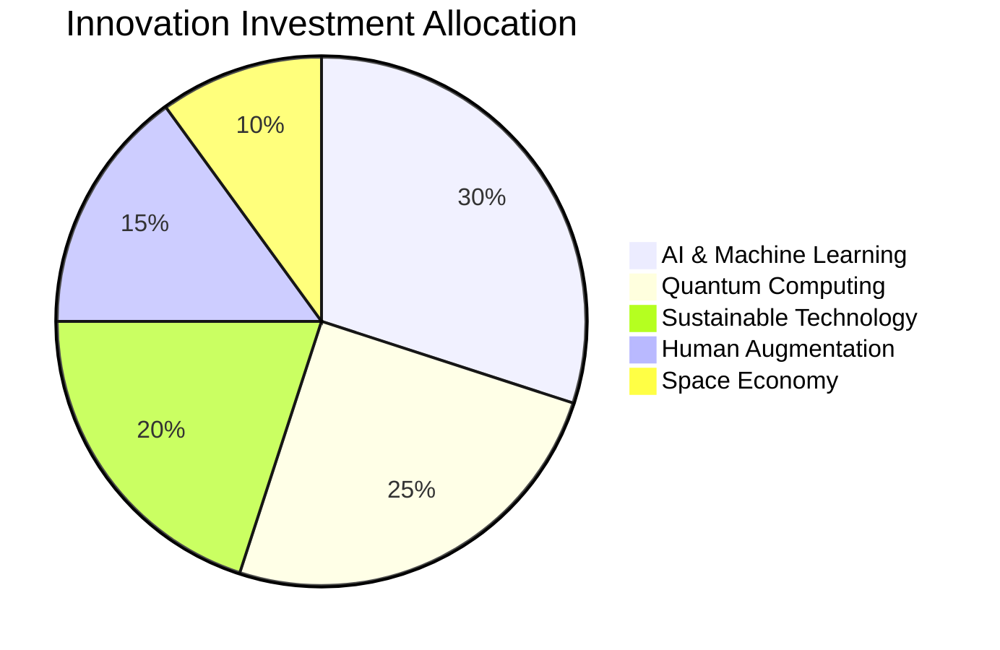

```mermaid
graph TD
    A[Investment Opportunities] --> B[Early Stage Ventures]
    A --> C[Strategic Partnerships]
    A --> D[Research Collaborations]
    A --> E[Technology Licensing]

    B --> F[Quantum Startups: $500M fund]
    B --> G[AI Unicorns: $1B portfolio]
    B --> H[Space Companies: $250M investments]

    C --> I[University Partnerships: 50 institutions]
    C --> J[Corporate Collaborations: 200 companies]
    C --> K[Government Contracts: $2B value]

    D --> L[Joint Research: 300 projects]
    D --> M[Shared IP: 1,500 patents]
    D --> N[Technology Transfer: 89 commercialized]

    E --> O[Patent Licensing: $150M/year revenue]
    E --> P[Technology Royalties: $300M/year]
    E --> Q[Platform Fees: $500M/year]

    style A fill:#8b5cf6,color:#fff
    style B fill:#f97316,color:#fff
    style C fill:#eab308,color:#000
    style D fill:#84cc16,color:#000
    style E fill:#10b981,color:#fff
```

```kpi-grid
[
  { "label": "Portfolio Value", "value": "$50B" },
  { "label": "Annual Returns", "value": "35%" },
  { "label": "New Industries Created", "value": "12" },
  { "label": "Jobs Created", "value": "500K+" },
  { "label": "Global Impact", "value": "2.1B people" },
  { "label": "Economic Value", "value": "$2T" }
]
```

## Innovation & Technology Glossary {#glossary}

```glossary
```
