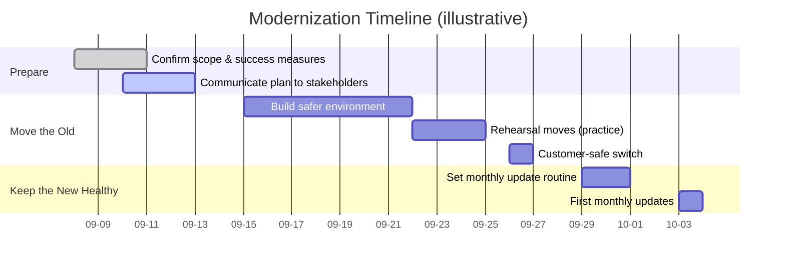

```json frontmatter
{
  "title": "Modernization Program — Executive Approval",
  "theme": {
    "mode": "light",
    "colors": {
      "light": {
        "primary": "#0ea5e9",
        "secondary": "#64748b",
        "background": "#ffffff",
        "surface": "#f8fafc",
        "text": "#0f172a",
        "text-secondary": "#64748b"
      },
      "dark": {
        "primary": "#38bdf8",
        "secondary": "#94a3b8",
        "background": "#0b1220",
        "surface": "#152132",
        "text": "#e5f0ff",
        "text-secondary": "#b7c6de"
      }
    }
  },
  "hero": {
    "title": "Make Change Safe: Move the Old, Keep the New Healthy",
    "subtitle": "Two moves, one outcome: lower risk, fewer incidents, and predictable costs",
    "highlights": [
      { "metric": "Our ask", "value": "Approve budget & timeline", "label": "see Decisions" },
      { "metric": "Business value", "value": "Protect revenue & brand", "label": "reduce outage risk" },
      { "metric": "Ongoing win", "value": "Monthly ‘oil change’ updates", "label": "avoid future fire drills" }
    ],
    "callToActions": [
      { "text": "See the Plan", "link": "#plan", "primary": true },
      { "text": "Decisions Needed", "link": "#decisions", "primary": false }
    ]
  },
  "navigation": {
    "mode": "ordered",
    "order": ["intro", "what", "why", "options", "plan", "safety", "cost", "decisions", "success", "faq", "glossary"]
  },
  "mermaid": {
    "config": {
      "gantt": { "barHeight": 28, "barGap": 10, "topPadding": 60, "leftPadding": 120, "axisFormat": "%m-%d" },
      "flowchart": { "curve": "basis", "nodeSpacing": 70, "rankSpacing": 80 },
      "sequence": { "diagramMarginX": 60, "diagramMarginY": 20 },
      "themeVariables": {
        "fontSize": "16px",
        "primaryColor": "#0ea5e9",
        "primaryTextColor": "#0f172a",
        "lineColor": "#0ea5e9",
        "gridColor": "#94a3b8"
      }
    },
    "perChartDefaults": {
      "gantt": { "axisFormat": "%m-%d" }
    }
  },
  "glossary": [
    { "term": "Downtime", "definition": "Time when customers can’t use our service." },
    { "term": "Maintenance window", "definition": "A planned period to make changes with little or no customer impact." },
    { "term": "Rollback", "definition": "A fast, safe return to the prior version if the new one misbehaves." },
    { "term": "Freeze window", "definition": "A short pause on risky changes during key business days." },
    { "term": "Phased rollout", "definition": "Turning on a change for a small slice first to limit risk." },
    { "term": "Patch", "definition": "A small fix or security update." },
    { "term": "Major update", "definition": "A larger change that may alter how parts work together." },
    { "term": "Compliance review", "definition": "A check that we meet contractual and regulatory requirements." },
    { "term": "Business continuity", "definition": "Our ability to keep operating through issues and recover quickly." }
  ]
}
```

## Executive Summary {#intro}

We’re asking to **retire risky, aging servers** and **establish a simple monthly update habit** on the newer stack. Think of this as moving to a safer building *and* scheduling regular fire-alarm tests.

**What you get**

- Fewer outages and late-night emergencies  
- Lower risk of security headlines and compliance findings  
- More predictable costs and easier future changes

> [!NOTE]: What’s changing in plain terms
> 1) We move old systems to a supported, well-managed platform.  
> 2) We keep modern systems healthy with small, regular updates—like an oil change.

---

## What We’re Changing (No Jargon) {#what}

- **Move the Old:** Shift our legacy servers to a supported platform with backup and monitoring built in. Customers should not notice the move.  
- **Keep the New Healthy:** Put a **monthly update routine** in place so the “new stuff” stays new—small changes, less risk.

**Why this is one program:** If we only move the old, the new will age into the next crisis. If we only update the new, the old remains a ticking clock. Doing both makes the benefits stick.

---

## Why Now {#why}

- **Risk is rising:** Older systems miss security fixes and vendor support.  
- **Costs creep:** We pay extra in time and stress for every change on outdated tech.  
- **Customers notice outages, not internal wins:** This avoids the kind of downtime that harms trust and revenue.  
- **Upcoming busy season:** We need to land changes **before** peak periods.

> [!WARN]: If we delay
> We accept higher outage risk, rising security exposure, and costlier emergency work. Future migrations get harder and more expensive.

---

## Options & Recommendation {#options}

| Option | What it means | Risk | Cost | Our view |
| --- | --- | --- | --- | --- |
| A — Do nothing | Keep running as is | High, rising | Unpredictable (fire drills) | Not recommended |
| B — Move old only | Migrate legacy; no update routine | Medium (improves now, decays later) | Medium one-time | Better, but problems return |
| **C — Move + Maintain** | Migrate legacy **and** adopt monthly updates | **Low, stays low** | Medium one-time + small ongoing | **Recommended** |

> [!TIP]: Why C wins
> Small, steady updates keep risk low and costs smooth—no more “big bang” crises.

---

## Plan at a Glance {#plan}



**Milestones**

- Practice the move twice before the real thing  
- Switch over during a **maintenance window**  
- Keep a **rollback** ready to restore in minutes if needed

---

## How We Keep Customers Safe {#safety}

- **Practice first:** We rehearse the move, measure results, fix issues.  
- **Small blast radius:** We do a **phased rollout**—turn it on for a small slice first.  
- **Fast undo:** If anything looks off, **rollback** restores the prior version quickly.  
- **Clear communications:** We use a short **maintenance window** with advance notice.  
- **Pause button:** A **freeze window** avoids risky changes during major business days.

---

## Cost & Value (Executive View) {#cost}

> Replace bracketed fields with your numbers when ready.

**One-time program** (move the old):  
- Cloud/infra setup: **[ $___ ]**  
- Migration effort (internal/partner): **[ $___ ]**

**Ongoing (keep the new healthy):**  
- Monthly update day (team time + tools): **[ $___ /month ]**

**Value (annualized):**  
- Outages avoided (lost revenue + support): **[ $___ ]**  
- Fewer emergency hours / contractor spend: **[ $___ ]**  
- Retired licenses / hardware / hosting: **[ $___ ]**

**Simple ROI framing:**  
`ROI = (Outages avoided + Emergency work avoided + Retired costs) − Program cost`

---

## Decisions We Need From You {#decisions}

- **Budget cap** for the one-time move and the monthly routine  
- **Preferred timing** for the maintenance window (weekday evening or weekend morning)  
- **Risk posture** for rollout speed (more gradual vs. faster)  
- **Executive sponsor** for communications (name & channel)  
- **Compliance reviewer** sign-off (name & date)

> [!NOTE]: We’ll bring back a short update after rehearsals with any changes to scope or timing.

---

## How We’ll Measure Success {#success}

```kpi-grid
[
  { "label": "Customer-visible downtime during move", "value": "≤ 10 minutes" },
  { "label": "Unplanned incidents next quarter", "value": "0 high-severity" },
  { "label": "Time to undo (rollback) if needed", "value": "≤ 10 minutes" },
  { "label": "Monthly update completion", "value": "100% on schedule" },
  { "label": "Emergency change requests", "value": "−50% vs. last quarter" }
]
```

---

## FAQ (Fast Answers, No Jargon) {#faq}

**Will customers see this?**  
We plan it so most do not. We use a short **maintenance window** and test thoroughly.

**What if something goes wrong?**  
We practice first and keep a **rollback** ready to restore the prior version quickly.

**Why not wait?**  
Waiting raises risk and cost. The move gets harder the longer we delay.

**Why a monthly routine?**  
Small, regular updates prevent big emergencies. It’s an oil change, not an engine swap.

**How long is the whole program?**  
About **3–4 weeks** from approval to cutover, then a steady monthly rhythm.

---

## Glossary {#glossary}

```glossary
```
