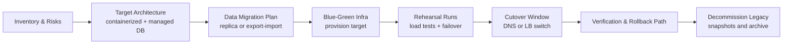
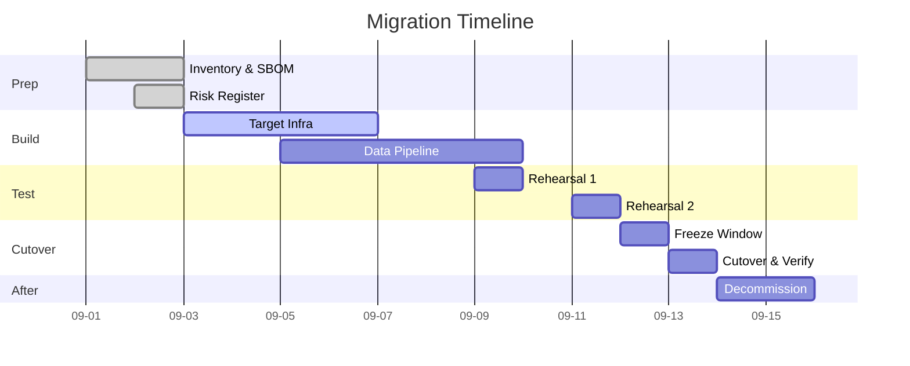
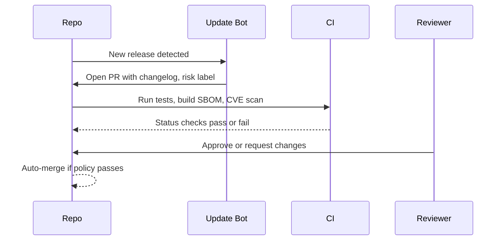

```json frontmatter
{
  "title": "Migration + Maintenance Example Deck",
  "theme": {
    "mode": "light",
    "colors": {
      "light": {
        "primary": "#2563eb",
        "secondary": "#64748b",
        "background": "#ffffff",
        "surface": "#f8fafc",
        "text": "#0f172a",
        "text-secondary": "#64748b"
      },
      "dark": {
        "primary": "#60a5fa",
        "secondary": "#94a3b8",
        "background": "#0b1220",
        "surface": "#152132",
        "text": "#e5f0ff",
        "text-secondary": "#b7c6de"
      }
    }
  },
  "hero": {
    "title": "Keep It Running: Migration and Maintenance",
    "subtitle": "One roadmap that retires legacy risk and builds a habit of healthy updates",
    "highlights": [
      { "metric": "Uptime", "value": "99.95%", "label": "rolling 30 days" },
      { "metric": "Legacy retired", "value": "6 services", "label": "Q3 target" },
      { "metric": "CVEs reduced", "value": "78%", "label": "critical and high" }
    ],
    "callToActions": [
      { "text": "Start with Migration", "link": "#migration", "primary": true },
      { "text": "Jump to Dependency Hygiene", "link": "#deps", "primary": false }
    ]
  },
  "navigation": {
    "mode": "ordered",
    "order": ["intro", "migration", "deps", "scorecard", "glossary"]
  },
  "mermaid": {
    "config": {
      "flowchart": { "curve": "basis", "nodeSpacing": 70, "rankSpacing": 80 },
      "sequence":  { "diagramMarginX": 60, "diagramMarginY": 20 },
      "gantt":     { "barHeight": 28, "barGap": 10, "topPadding": 60, "leftPadding": 120, "axisFormat": "%m-%d" },
      "themeVariables": {
        "fontSize": "16px",
        "primaryColor": "#2563eb",
        "primaryTextColor": "#0f172a",
        "lineColor": "#2563eb",
        "gridColor": "#94a3b8"
      }
    },
    "perChartDefaults": {
      "gantt": { "axisFormat": "%m-%d" }
    }
  },
  "glossary": [
    { "term": "SLO", "definition": "Service Level Objective. A target level for reliability measured by user-visible metrics like availability or latency." },
    { "term": "RTO", "definition": "Recovery Time Objective. The maximum acceptable time to restore service after an incident." },
    { "term": "RPO", "definition": "Recovery Point Objective. The maximum acceptable data loss measured in time." },
    { "term": "SBOM", "definition": "Software Bill of Materials. A machine-readable inventory of components and dependencies." },
    { "term": "CVE", "definition": "Common Vulnerabilities and Exposures. A catalog of publicly disclosed security issues." },
    { "term": "SemVer", "definition": "Semantic Versioning. MAJOR.MINOR.PATCH rules for compatibility and change scope." },
    { "term": "Blue-Green", "definition": "Two identical production environments. Switch traffic to the new one, keep the old as fallback." },
    { "term": "Canary", "definition": "Release to a small slice of users or traffic first to reduce blast radius." },
    { "term": "Freeze Window", "definition": "A scheduled period with no risky deploys, often during holidays or major events." }
  ]
}
```

## Executive Context {#intro}

This deck shows one story with two tracks. First, we move a legacy server workload to a safer and more scalable target. Second, we put a real process in place that keeps package versions and frameworks healthy in the newer stack. The result is lower risk, easier changes, and faster recovery.

> [!NOTE]: How to read this deck
> Migration covers one-off change with a deadline. Dependency hygiene covers the always-on process that prevents the next migration crisis.

---

## Legacy Server Migration {#migration}

### Goals and Constraints {#mig-goals}

* Retire unsupported OS and runtime
* Zero data loss, RPO 5 minutes, RTO 30 minutes
* Keep public endpoints stable for clients
* Use blue-green or canary where possible

> [!WARN]: Tight database coupling
> A shared database across legacy and target stacks creates hidden coupling. Plan a read-replica or dual-write strategy before cutover.

### Plan Overview {#mig-plan}



### Timeline {#mig-timeline}



> [!TIP]: Freeze window rule of thumb
> One full business day is often enough for small services. Extend if database size or client diversity is high.

### Cutover Strategy {#mig-cutover}

* Prefer blue-green with health checks and traffic switch at the load balancer
* If data shape changes, use dual-write for a limited period then finalize
* Keep rollback ready with a known good AMI or container version

### Migration KPIs {#mig-kpis}

```kpi-grid
[
  { "label": "RTO objective", "value": "≤ 30m" },
  { "label": "RPO objective", "value": "≤ 5m" },
  { "label": "Rollback time", "value": "≤ 10m" },
  { "label": "Error rate post cutover", "value": "< 1%" },
  { "label": "Legacy cost runway", "value": "−80% in 14 days" }
]
```

---

## Modern Stack: Dependency Hygiene {#deps}

### Inventory and Policy {#deps-policy}

* Generate an SBOM for each service on every build
* Adopt SemVer rules and set update policy

  * patch updates auto-merge
  * minor updates weekly batch
  * major updates quarterly with testing plan

> [!NOTE]: Compliance boost
> SBOM plus CVE scanning improves audit posture and helps with vendor risk questionnaires.

### Automation Pipeline {#deps-automation}



**Sample status table**

| Package | Current | Latest | Policy          | Status           |
| ------- | ------- | ------ | --------------- | ---------------- |
| react   | 18.2.0  | 18.3.1 | minor weekly    | pending in batch |
| axios   | 1.6.8   | 1.7.4  | patch auto      | auto-merged      |
| express | 4.19.2  | 5.1.0  | major quarterly | scheduled Q4     |
| prisma  | 5.9.1   | 5.16.0 | minor weekly    | tests failing    |

> [!WARN]: Major version fatigue
> Too many majors in one quarter overwhelms teams. Cap the number per cycle and stagger by service criticality.

### Cadence and Windows {#deps-cadence}

* Weekly batch day for minor updates
* Daily auto-merge for patches that pass tests
* Freeze windows for holidays and big launches

### Dependency KPIs {#deps-kpis}

```kpi-grid
[
  { "label": "Patch lead time", "value": "≤ 2 days" },
  { "label": "Minor batch failure rate", "value": "< 10%" },
  { "label": "Critical CVEs open", "value": "0" },
  { "label": "Update PR cycle time", "value": "≤ 24h median" },
  { "label": "Outdated packages", "value": "−60% in 30 days" }
]
```

---

## Unified Ops Scorecard {#scorecard}

* One habit supports both tracks: small safe changes ship faster, which makes big changes simpler too.

```kpi-grid
[
  { "label": "Change failure rate", "value": "< 5%" },
  { "label": "MTTR", "value": "≤ 20m" },
  { "label": "SLO breaches", "value": "0 this quarter" },
  { "label": "Deploy frequency", "value": "daily" }
]
```

---

## Glossary {#glossary}

```glossary
```
