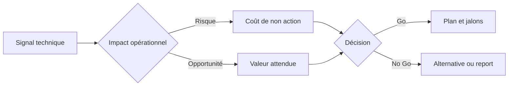
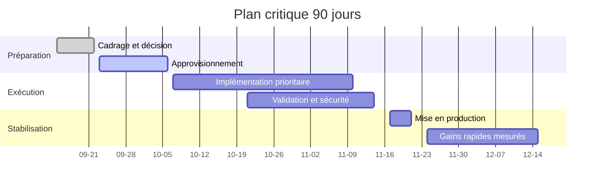
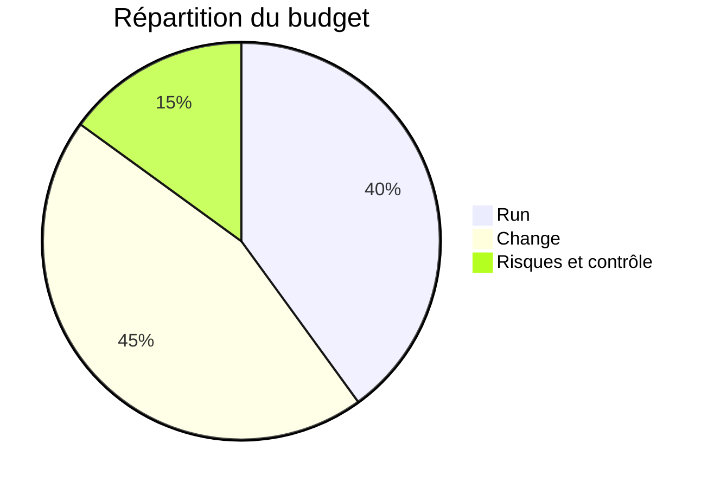

```json frontmatter
{
  "title": "Vendre des concepts techniques à des exécutifs",
  "theme": {
    "mode": "light",
    "colors": {
      "light": {
        "primary": "#2563eb",
        "secondary": "#64748b",
        "background": "#ffffff",
        "surface": "#f8fafc",
        "text": "#0f172a",
        "text-secondary": "#64748b"
      },
      "dark": {
        "primary": "#60a5fa",
        "secondary": "#94a3b8",
        "background": "#0b1220",
        "surface": "#152132",
        "text": "#e5f0ff",
        "text-secondary": "#b7c6de"
      }
    }
  },
  "hero": {
    "title": "Faire avancer les dossiers techniques",
    "subtitle": "Parler valeur, risque et décision pour convaincre un comité exécutif",
    "highlights": [
      { "metric": "Clarté", "value": "7 diapositives", "label": "Storyline décision" },
      { "metric": "Impact", "value": "≤ 10 min", "label": "Pour obtenir un Go" },
      { "metric": "Suivi", "value": "5 KPI", "label": "Valeur rendue visible" }
    ],
    "callToActions": [
      { "text": "Voir la storyline", "link": "#storyline", "primary": true },
      { "text": "Modèles visuels", "link": "#visuels", "primary": false }
    ]
  },
  "mermaid": {
    "theme": "default",
    "fontFamily": "system-ui, -apple-system, Segoe UI, Roboto, sans-serif",
    "config": {
      "flowchart": { "curve": "basis", "nodeSpacing": 70, "rankSpacing": 80 },
      "sequence": { "diagramMarginX": 60, "diagramMarginY": 20 },
      "gantt": { "barHeight": 28, "barGap": 10, "topPadding": 60, "leftPadding": 120, "axisFormat": "%m-%d" },
      "pie": { "textPosition": 0.8 },
      "themeVariables": { "fontSize": "16px", "primaryColor": "#2563eb", "primaryTextColor": "#0f172a" }
    },
    "perChartDefaults": {
      "gantt": { "axisFormat": "%m-%d" }
    }
  },
  "glossary": [
    { "term": "KPI", "definition": "Indicateur clé de performance. Mesure un résultat lié à un objectif d’affaires." },
    { "term": "ROI", "definition": "Retour sur investissement. (Bénéfices - Coûts) / Coûts." },
    { "term": "OPEX", "definition": "Dépenses d’exploitation récurrentes." },
    { "term": "CAPEX", "definition": "Dépenses d’investissement non récurrentes." },
    { "term": "Risque résiduel", "definition": "Risque restant après les mesures de mitigation." },
    { "term": "Run-rate", "definition": "Tendance de coûts/volumes projetée à partir des données actuelles." },
    { "term": "Go/No Go", "definition": "Décision d’autoriser ou non un projet ou un jalon." }
  ]
}
```

## Introduction et objectif {#intro}
Ce guide aide les profils techniques à transformer des sujets peu attirants en décisions exécutives claires. Vous y trouverez une storyline courte, des modèles visuels, des KPIs qui parlent et une checklist prête à l’emploi.

> [!NOTE]: Hypothèses
> - Audience principale: comité exécutif mixte finance-produit-tech, temps disponible 10 à 15 minutes.
> - Contexte: organisation de taille moyenne en croissance, budget serré, appétence pour la réduction de risque.
> - Données chiffrées: à remplacer par vos chiffres internes avant diffusion.

### À qui s’adresse ce guide et ce que vous allez apprendre {#public-objectif}
- Pour: ingénierie, SRE, data, sécurité, produit.
- Objectif: parler valeur d’affaires, risque et calendrier plutôt que détails d’implémentation.
- Résultat: obtenir une décision et des moyens clairs pour avancer.

## Ce que recherchent vraiment les exécutifs {#executifs}
### Valeur, risques, décisions, délais {#criteres}
- Valeur attendue en langage d’affaires: revenus, coûts évités, risque réduit, conformité.
- Risques prioritaires: opération, sécurité, réputation, délai de mise en marché.
- Décision à prendre: Go partiel, Go total, No Go, arbitrage de portée ou de budget.
- Délai: quand l’impact devient visible et quand le risque baisse.

### Format et niveau de détail attendus {#format-detail}
- 7 diapositives maximum, lecture autonome possible.
- 1 message par diapositive, chiffré, avec source ou hypothèse.
- Fins de section avec demande claire: « Décision requise » et options.

> [!TIP]: Astuce rythme
> Commencez par l’impact, pas par la solution. Les détails techniques vont en annexe si le comité les demande.

## Traduire la technique en valeur métier {#traduction}
### Cadre Problème → Impact → Options → Recommandation {#cadre-pior}
- **Problème**: quel obstacle business mesurable se pose.
- **Impact**: coût actuel et risque si rien n’est fait.
- **Options**: 2 ou 3 choix, compromis et coût total (CAPEX + OPEX).
- **Recommandation**: pourquoi l’option A maximise la valeur au moindre risque.

### Cartographier risques, coûts, dépendances {#risques-couts}
- Risques: probabilité x gravité, précisez ce qui reste après mitigation.
- Coûts: run-rate actuel vs run-rate cible après réalisation.
- Dépendances critiques: fournisseurs, équipes, décisions amont.

### Mesurer l’avancement utile pour le comité {#avancement}
- KPI d’impact: coût évité par mois, incidents évités, délai moyen réduit.
- KPI de livraison: % jalons critiques complétés, scope livré vs prévu.
- Échelle de confiance: basique, central, haut pour vos estimations.

```kpi-grid
[
  { "label": "Décision requise", "value": "Go partiel sur périmètre prioritaire" },
  { "label": "Valeur attendue 12 mois", "value": "$380k coûts évités + -25% incidents" },
  { "label": "Investissement total", "value": "$210k (CAPEX) + $11k/mo OPEX" },
  { "label": "Temps vers premier impact", "value": "60 jours" },
  { "label": "Risque résiduel", "value": "Faible à moyen, contrôlé par 3 mesures" }
]
```

## La storyline de décision en 7 diapositives {#storyline}
### 1 Problème d’affaires et contexte {#s1}
- Quel KPI souffre et combien ça coûte par mois. Qui est impacté.
- Pourquoi maintenant: contrainte client, audit, saisonnalité.

### 2 Impact chifré et urgence {#s2}
- Coût de non action à 12 mois. Incidents, SLA, revenus retardés.
- Scénarios basique, central, haut et échelle de confiance.

### 3 Options et compromis {#s3}
- Option A: rapide, valeur partielle, risque contenu.
- Option B: plus complète, plus longue, dépendances élevées.
- Option C: ne rien faire, documentez le coût.

### 4 Recommandation et valeur attendue {#s4}
- Pourquoi l’option recommandée maximise le ratio valeur/risque.
- Hypothèses principales et plan d’apprentissage si incertitude forte.

### 5 Plan, jalons, responsables {#s5}
- 5 jalons critiques, critères de passage, responsables nommés.
- Mesures de mitigation en place à chaque jalon.

### 6 Risques, mitigations, besoins {#s6}
- Top 3 risques résiduels, plan de repli, dépendances externes.
- Besoins: budget, équipes, arbitrages, accès.

### 7 Appel à décision et prochaines étapes {#s7}
- Décision demandée et date butoir.
- Étapes J+7, J+30, J+90 après Go.

## KPIs et tableaux de bord qui parlent au comité {#kpis}
### 5 indicateurs pour rendre la valeur tangible {#kpis-cles}
- Coût mensuel évité vs baseline.
- Incidents majeurs évités et minutes d’indisponibilité.
- Délai moyen de mise en production.
- Avancement jalons critiques.
- Risque résiduel qualifié.

### Échelle de confiance et scénarios {#confiance-scenarios}
- Basique: hypothèses prudentes, intervalle large.
- Central: hypothèses probables, intervalle moyen.
- Haut: hypothèses ambitieuses, à sécuriser par preuves.

## Modèles visuels prêts à l’emploi {#visuels}
### Flowchart décision: de la technique à la valeur {#flowchart}


### Gantt épuré pour jalons critiques {#gantt}


### Pie budget et risque {#pie}


## Bonnes pratiques de présentation pour profils techniques {#bonnes-pratiques}
### Clarté, rythme, hiérarchie visuelle {#clarte-rythme}
- Une idée par diapositive, titre en message d’action.
- Chiffres en gras, unité claire, source en note.
- Utilisez les callouts ci-dessous pour guider l’attention.

> [!NOTE]: Message unique
> Le titre doit contenir le message final de la diapo. Ex: « Réduire -25% d’incidents en 90 jours pour $210k ». Le corps sert de preuve.

> [!TIP]: Slide lit seule
> Une diapo doit se comprendre sans orateur. Ajoutez 1 à 2 phrases contextuelles en bas si nécessaire.

> [!WARN]: Pièges fréquents
> Trop d’options, jargons non expliqués, métriques non reliées à un objectif, absence de demande de décision.

> [!QUOTE]: Formule utile
> « Voici le coût de non action, voici la valeur si on agit, voici la décision à prendre aujourd’hui. »

### Erreurs fréquentes à éviter {#erreurs}
- Commencer par l’architecture avant le problème d’affaires.
- Présenter 7 KPIs techniques sans lien avec un objectif d’entreprise.
- Finir sans demande de décision explicite.

## Atelier express et checklists {#atelier}
### Transformer un sujet peu sexy en proposition de valeur {#atelier-exo}
- Écrivez le problème d’affaires en 1 phrase chiffrée.
- Listez 2 options réalistes et le coût de non action.
- Choisissez une recommandation et 3 jalons avec responsables.

### Checklist avant envoi au comité {#checklist}
- Message final clair au titre de chaque diapo.
- Chiffres vérifiés, hypothèses listées, sources disponibles.
- Demande de décision écrite, date butoir, prochaines étapes.

## Annexes {#annexes}


### Modèles de phrases orientées valeur {#phrases}
- « Cette option réduit le risque résiduel de moyen à faible tout en livrant un gain mesurable en 60 jours. »
- « Le coût de non action est de $X par mois, soit $Y à 12 mois. »
- « Recommandation: Option A. Décision demandée: Go partiel d’ici le 15 du mois. »

### Glossaire exécutif et tournures utiles {#glossaire}
```glossary
```