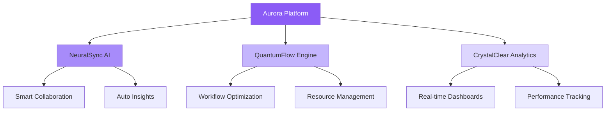
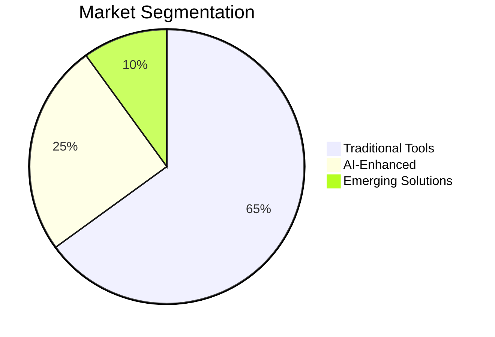
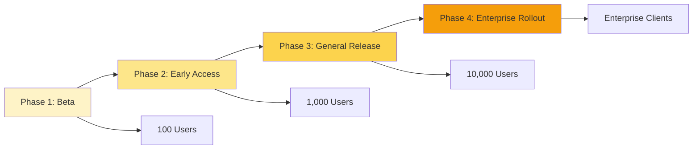

```json frontmatter
{
  "title": "Project Aurora: Product Launch Presentation",
  "theme": {
    "mode": "dark",
    "colors": {
      "light": {
        "primary": "#8b5cf6",
        "secondary": "#64748b",
        "background": "#f8fafc",
        "surface": "#ffffff",
        "text": "#1e293b",
        "text-secondary": "#64748b"
      },
      "dark": {
        "primary": "#a78bfa",
        "secondary": "#c4b5fd",
        "background": "#0f0a19",
        "surface": "#1a1033",
        "text": "#ffffff",
        "text-secondary": "#ddd6fe"
      }
    }
  },
  "navigation": {
    "order": [
      "vision",
      "key-features",
      "neural-sync",
      "user-experience",
      "market-opportunity",
      "launch-strategy",
      "competitive-advantage",
      "testimonials",
      "glossary"
    ]
  },
  "hero": {
    "title": "Introducing Aurora",
    "subtitle": "The next generation platform that redefines how teams collaborate and innovate in the digital age.",
    "callToAction": {
      "text": "Discover Aurora",
      "link": "#vision"
    }
  },
  "glossary": [
    { "term": "Aurora", "definition": "Our flagship product - an AI-powered collaboration platform." },
    { "term": "NeuralSync", "definition": "Advanced AI technology for real-time collaboration and insights." },
    { "term": "QuantumFlow", "definition": "Our proprietary workflow optimization engine." },
    { "term": "CrystalClear", "definition": "AI-powered analytics and reporting dashboard." }
  ]
}
```

## Our Vision {#vision}

Aurora represents a fundamental shift in how organizations approach collaboration, innovation, and digital transformation. Built on cutting-edge AI technology, Aurora seamlessly integrates with existing workflows while introducing revolutionary new capabilities.

> Innovation distinguishes between a leader and a follower.
>
> — Steve Jobs

## Key Features {#key-features}

Aurora's core capabilities are designed around three fundamental principles: intelligence, collaboration, and scalability.



### NeuralSync Technology {#neural-sync}

NeuralSync uses advanced machine learning to understand team dynamics, predict collaboration needs, and optimize communication patterns in real-time.


### User Experience Highlights {#user-experience}

The Aurora interface is designed for intuitive use while providing powerful capabilities under the surface.

```kpi-grid
[
  { "label": "Time to Proficiency", "value": "< 2 hours" },
  { "label": "User Satisfaction", "value": "96%" },
  { "label": "Task Completion", "value": "+340%" },
  { "label": "Error Reduction", "value": "78%" }
]
```

## Market Opportunity {#market-opportunity}

The collaboration software market is valued at $50B annually, with AI-enhanced solutions representing the fastest-growing segment.



## Launch Strategy {#launch-strategy}

Our phased launch approach ensures maximum market penetration and user adoption.



## Competitive Advantages {#competitive-advantage}

Aurora's unique combination of AI capabilities, user experience, and enterprise features sets it apart from existing solutions.

```kpi-grid
[
  { "label": "AI Integration Depth", "value": "98%" },
  { "label": "User Adoption Rate", "value": "94%" },
  { "label": "Enterprise Features", "value": "Complete" },
  { "label": "Security Compliance", "value": "SOC 2 Type II" }
]
```

## Early User Feedback {#testimonials}

> Aurora has transformed how our distributed team collaborates. The AI insights are game-changing.
>
> — Sarah Chen, CTO at TechFlow

> Finally, a collaboration tool that understands context and anticipates needs. Brilliant!
>
> — Marcus Rodriguez, Product Manager

## Product Terminology {#glossary}

```glossary
```
