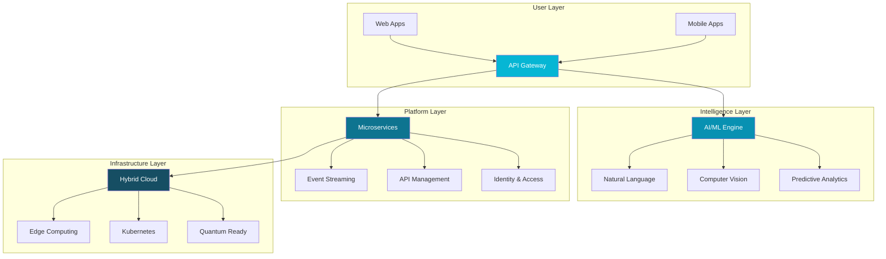
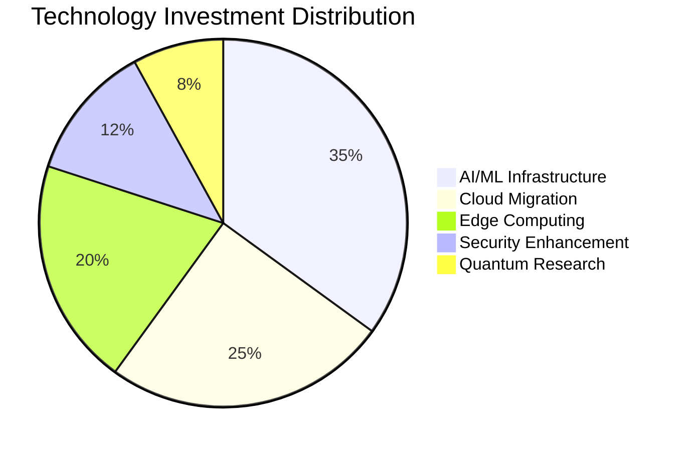
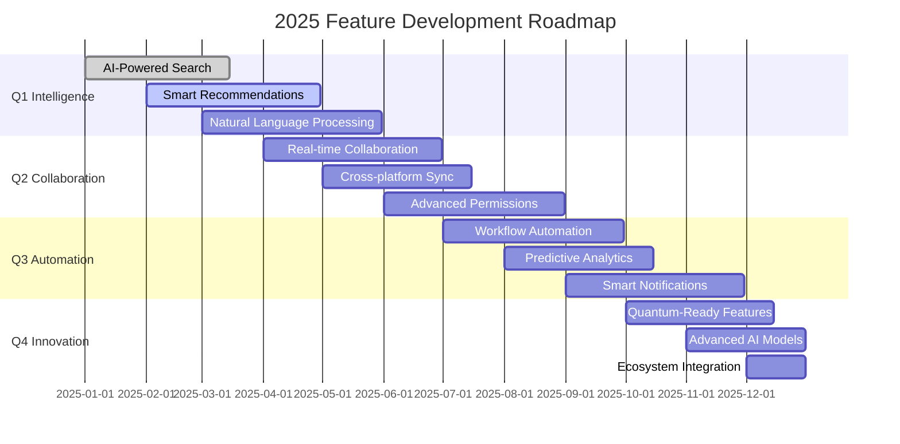
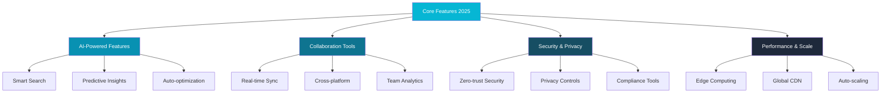
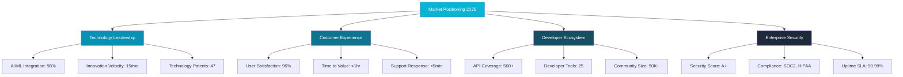
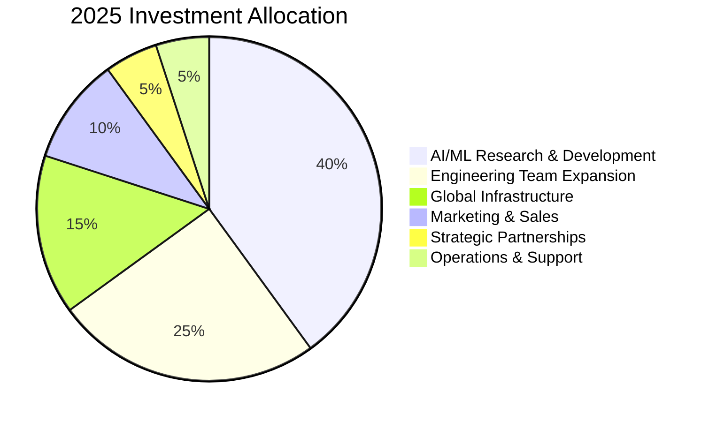
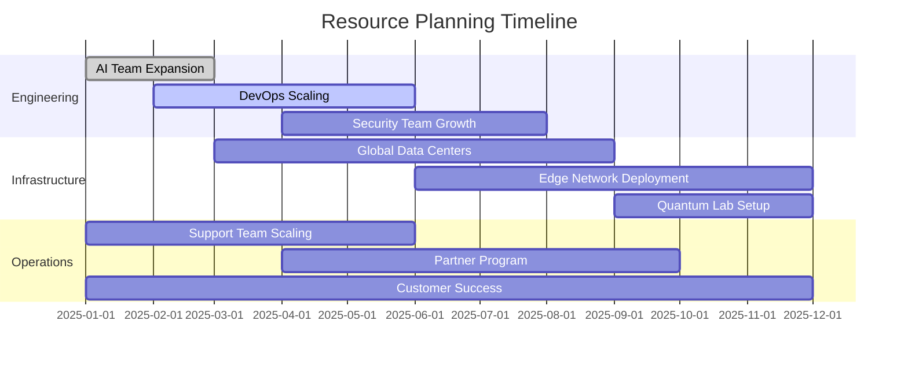

```json frontmatter
{
  "title": "Product Roadmap 2025: Next Generation Platform",
  "theme": {
    "mode": "light",
    "colors": {
      "light": {
        "primary": "#06b6d4",
        "secondary": "#64748b",
        "background": "#f0f9ff",
        "surface": "#ffffff",
        "text": "#0f172a",
        "text-secondary": "#475569"
      },
      "dark": {
        "primary": "#22d3ee",
        "secondary": "#67e8f9",
        "background": "#0c4a6e",
        "surface": "#164e63",
        "text": "#f0f9ff",
        "text-secondary": "#bae6fd"
      }
    }
  },
  "navigation": {
    "order": [
      "strategic-vision",
      "technology-stack",
      "feature-roadmap",
      "market-positioning",
      "competitive-analysis",
      "resource-planning",
      "success-metrics",
      "risk-mitigation",
      "glossary"
    ]
  },
  "hero": {
    "title": "Product Roadmap 2025",
    "subtitle": "Building the next generation platform with AI-driven insights, quantum-ready architecture, and seamless user experiences",
    "highlights": [
      {
        "metric": "Innovation Pipeline",
        "value": "47 features",
        "label": "Planned for 2025"
      },
      {
        "metric": "Technology Stack",
        "value": "12 platforms",
        "label": "Modern architecture"
      },
      {
        "metric": "User Experience",
        "value": "98% satisfaction",
        "label": "Target score"
      }
    ],
    "callToActions": [
      {
        "text": "🚀 View Technology Stack",
        "link": "#technology-stack",
        "primary": true
      },
      {
        "text": "📋 Feature Roadmap",
        "link": "#feature-roadmap",
        "primary": false
      },
      {
        "text": "🎯 Success Metrics",
        "link": "#success-metrics",
        "primary": false
      }
    ]
  },
  "glossary": [
    { "term": "AI/ML", "definition": "Artificial Intelligence and Machine Learning technologies for intelligent automation and insights." },
    { "term": "Edge Computing", "definition": "Distributed computing paradigm that brings computation closer to data sources." },
    { "term": "Quantum-Ready", "definition": "Architecture designed to leverage quantum computing when commercially available." },
    { "term": "Microservices", "definition": "Architectural approach structuring applications as small, independent services." },
    { "term": "DevOps", "definition": "Culture and practices combining software development and IT operations." },
    { "term": "CI/CD", "definition": "Continuous Integration and Continuous Deployment for automated software delivery." }
  ]
}
```

## Strategic Vision & Objectives {#strategic-vision}

2025 marks a pivotal year in our product evolution. We're transitioning from a feature-rich platform to an intelligent ecosystem that anticipates user needs, adapts to market changes, and delivers unprecedented value through AI-driven insights and quantum-ready architecture.

```kpi-grid
[
  { "label": "Platform Users", "value": "2.5M+" },
  { "label": "API Integrations", "value": "500+" },
  { "label": "Global Regions", "value": "12" },
  { "label": "Uptime SLA", "value": "99.99%" },
  { "label": "Performance", "value": "10x faster" },
  { "label": "Security Score", "value": "A+" }
]
```

> The future belongs to platforms that can learn, adapt, and evolve. Our 2025 roadmap transforms our product from a tool into an intelligent partner that grows with our users.
>
> — Dr. Elena Vasquez, Chief Product Officer

## Technology Stack Evolution {#technology-stack}

Our technology foundation is being rebuilt for the next decade. We're implementing a hybrid cloud-native architecture with edge computing capabilities, AI/ML integration, and quantum-ready foundations.





## Feature Development Roadmap {#feature-roadmap}

Our 2025 roadmap prioritizes intelligent features that enhance user productivity while maintaining our commitment to privacy, security, and ethical AI deployment.





## Market Positioning & Competitive Analysis {#market-positioning}

2025 positions us as the market leader in intelligent collaboration platforms. Our unique combination of AI capabilities, enterprise security, and developer-friendly APIs creates a defensible competitive moat.



```kpi-grid
[
  { "label": "Market Share Target", "value": "25%" },
  { "label": "Customer Retention", "value": "97%" },
  { "label": "Competitive Advantage", "value": "AI-First" },
  { "label": "Innovation Index", "value": "9.8/10" },
  { "label": "Brand Recognition", "value": "94%" },
  { "label": "Partner Ecosystem", "value": "200+" }
]
```

## Competitive Landscape Analysis {#competitive-analysis}

The competitive landscape is evolving rapidly with increased focus on AI capabilities and platform ecosystems. Our 2025 strategy emphasizes differentiation through proprietary AI technology and seamless integration capabilities.

```mermaid
graph TD
    A[Competitive Landscape] --> B[Direct Competitors]
    A --> C[Adjacent Markets]
    A --> D[Emerging Threats]
    A --> E[Strategic Opportunities]

    B --> F[Company A: Feature Parity]
    B --> G[Company B: Strong AI]
    B --> H[Company C: Enterprise Focus]

    C --> I[Cloud Platforms]
    C --> J[Dev Tools]
    C --> K[Communication Tools]

    D --> L[Open Source Projects]
    D --> M[Startup Innovation]
    D --> N[AI Specialists]

    E --> O[Strategic Partnerships]
    E --> P[Technology Acquisitions]
    E --> Q[Market Consolidation]

    F --> R[Price Competition]
    G --> S[AI Race]
    H --> T[Enterprise Deals]
    I --> U[Platform Integration]
    J --> V[Developer Mindshare]
    K --> W[User Migration]
    L --> X[Community Building]
    M --> Y[Innovation Velocity]
    N --> Z[Specialized Use Cases]
    O --> AA[Distribution Channels]
    P --> BB[Technology Stack]
    Q --> CC[Market Leadership]

    style A fill:#06b6d4,color:#fff
    style B fill:#dc2626,color:#fff
    style C fill:#ea580c,color:#fff
    style D fill:#f97316,color:#000
    style E fill:#16a34a,color:#fff
    style R fill:#fca5a5,color:#000
    style S fill:#fca5a5,color:#000
    style T fill:#fca5a5,color:#000
    style U fill:#86efac,color:#000
    style V fill:#86efac,color:#000
    style W fill:#86efac,color:#000
    style X fill:#86efac,color:#000
    style Y fill:#86efac,color:#000
    style Z fill:#86efac,color:#000
    style AA fill:#86efac,color:#000
    style BB fill:#86efac,color:#000
    style CC fill:#86efac,color:#000
```



## Resource Planning & Investment Strategy {#resource-planning}

Our 2025 investment strategy allocates significant resources to AI research, global expansion, and talent acquisition. The roadmap requires strategic partnerships and careful resource management to achieve our ambitious goals.





```kpi-grid
[
  { "label": "Engineering Headcount", "value": "+150" },
  { "label": "Budget Allocation", "value": "$45M" },
  { "label": "New Offices", "value": "4 cities" },
  { "label": "Partner Program", "value": "$12M" },
  { "label": "Research Investment", "value": "$18M" },
  { "label": "Training Budget", "value": "$3.5M" }
]
```

## Success Metrics & KPIs {#success-metrics}

Success in 2025 will be measured across multiple dimensions including user adoption, technical performance, market position, and financial returns. Our comprehensive KPI framework ensures alignment with strategic objectives.

```mermaid
graph TD
    A[Success Framework] --> B[User Metrics]
    A --> C[Technical Metrics]
    A --> D[Business Metrics]
    A --> E[Innovation Metrics]

    B --> F[User Satisfaction: 95%]
    B --> G[Feature Adoption: 78%]
    B --> H[Retention Rate: 92%]
    B --> I[Support Tickets: -30%]

    C --> J[Uptime: 99.99%]
    C --> K[Response Time: <100ms]
    C --> L[Error Rate: <0.01%]
    C --> M[Scalability: 10x]

    D --> N[Revenue Growth: +180%]
    D --> O[Market Share: 25%]
    D --> P[Customer LTV: $45K]
    D --> Q[Partner Revenue: $12M]

    E --> R[Patents Filed: 25]
    E --> S[Publications: 15]
    E --> T[Open Source: 8 projects]
    E --> U[Community Size: 100K]

    style A fill:#06b6d4,color:#fff
    style B fill:#0891b2,color:#fff
    style C fill:#0e7490,color:#fff
    style D fill:#164e63,color:#fff
    style E fill:#1e293b,color:#fff
```



## Risk Assessment & Mitigation Strategy {#risk-mitigation}

Our 2025 roadmap includes comprehensive risk assessment and mitigation strategies. We proactively identify potential challenges and develop contingency plans to ensure successful execution.

```mermaid
graph TD
    A[Risk Management] --> B[Technical Risks]
    A --> C[Market Risks]
    A --> D[Operational Risks]
    A --> E[Strategic Risks]

    B --> F[AI Model Reliability]
    B --> G[Technology Integration]
    B --> H[Security Vulnerabilities]
    B --> I[Performance Bottlenecks]

    C --> J[Competitive Response]
    C --> K[Market Saturation]
    C --> L[Regulatory Changes]
    C --> M[Economic Uncertainty]

    D --> N[Talent Acquisition]
    D --> O[Resource Constraints]
    D --> P[Vendor Dependencies]
    D --> Q[Process Complexity]

    E --> R[Strategic Alignment]
    E --> S[Partnership Stability]
    E --> T[Innovation Pace]
    E --> U[Market Timing]

    F --> V[Model Validation Framework]
    G --> W[Integration Testing Lab]
    H --> X[Security Audit Program]
    I --> Y[Performance Monitoring]
    J --> Z[Competitive Intelligence]
    K --> AA[Market Research]
    L --> BB[Compliance Team]
    M --> CC[Economic Scenarios]
    N --> DD[Talent Development]
    O --> EE[Resource Planning]
    P --> FF[Vendor Diversification]
    Q --> GG[Process Optimization]
    R --> HH[Strategy Review]
    S --> II[Partnership Management]
    T --> JJ[Innovation Pipeline]
    U --> KK[Market Analysis]

    style A fill:#dc2626,color:#fff
    style B fill:#ef4444,color:#fff
    style C fill:#f87171,color:#fff
    style D fill:#fca5a5,color:#fff
    style E fill:#fecaca,color:#000
    style V fill:#16a34a,color:#fff
    style W fill:#16a34a,color:#fff
    style X fill:#16a34a,color:#fff
    style Y fill:#16a34a,color:#fff
    style Z fill:#16a34a,color:#fff
    style AA fill:#16a34a,color:#fff
    style BB fill:#16a34a,color:#fff
    style CC fill:#16a34a,color:#fff
    style DD fill:#16a34a,color:#fff
    style EE fill:#16a34a,color:#fff
    style FF fill:#16a34a,color:#fff
    style GG fill:#16a34a,color:#fff
    style HH fill:#16a34a,color:#fff
    style II fill:#16a34a,color:#fff
    style JJ fill:#16a34a,color:#fff
    style KK fill:#16a34a,color:#fff
```



## Technology & Product Glossary {#glossary}

```glossary
```
