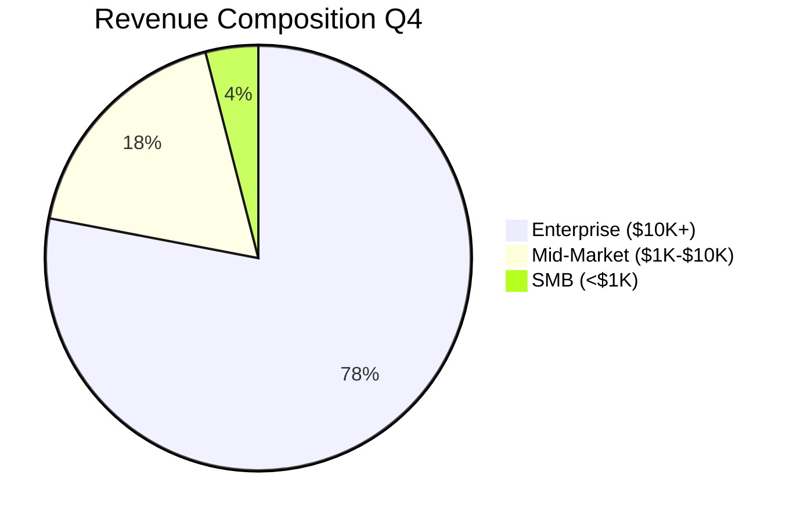
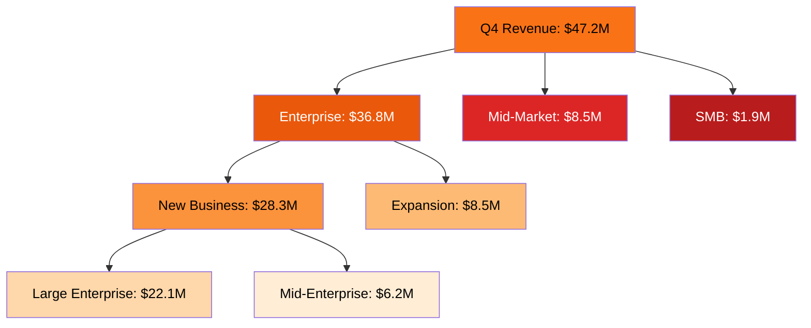
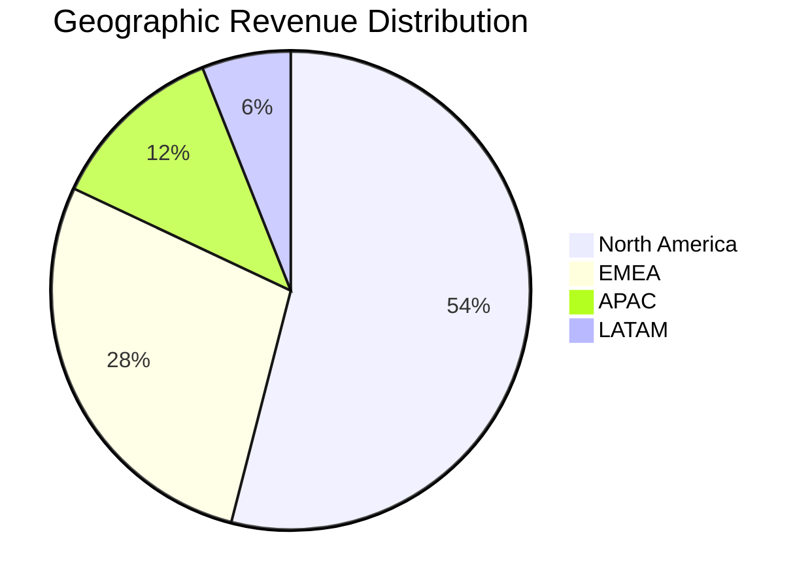
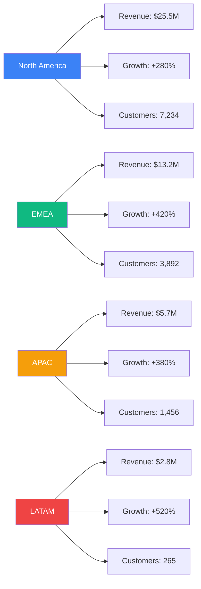
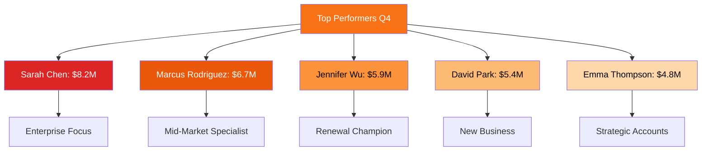
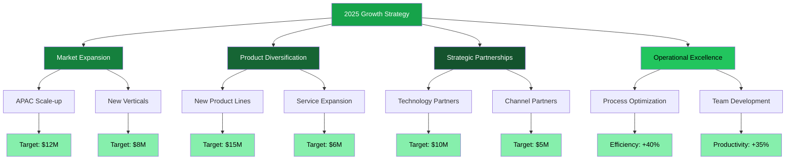
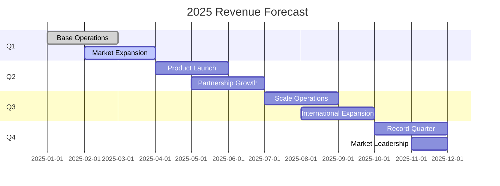

```json frontmatter
{
  "title": "Q4 Sales Performance Dashboard",
  "theme": {
    "mode": "dark",
    "colors": {
      "light": {
        "primary": "#f97316",
        "secondary": "#64748b",
        "background": "#fef7ed",
        "surface": "#ffffff",
        "text": "#1a1a1a",
        "text-secondary": "#64748b"
      },
      "dark": {
        "primary": "#fb923c",
        "secondary": "#fdba74",
        "background": "#0f0f0f",
        "surface": "#1a1a1a",
        "text": "#ffffff",
        "text-secondary": "#d4d4d8"
      }
    }
  },
  "navigation": {
    "order": [
      "executive-summary",
      "revenue-metrics",
      "sales-funnel",
      "geographic-performance",
      "team-leaderboard",
      "growth-opportunities",
      "forecast-analysis",
      "glossary"
    ]
  },
  "hero": {
    "title": "Q4 Sales Performance",
    "subtitle": "Record-breaking quarter with 340% growth and expanded market dominance",
    "highlights": [
      {
        "metric": "Revenue Growth",
        "value": "+340%",
        "label": "vs Q3 2024"
      },
      {
        "metric": "New Customers",
        "value": "12,847",
        "label": "Enterprise clients"
      },
      {
        "metric": "Market Share",
        "value": "34.7%",
        "label": "Industry leading"
      }
    ],
    "callToActions": [
      {
        "text": "📊 Deep Dive Analytics",
        "link": "#revenue-metrics",
        "primary": true
      },
      {
        "text": "🎯 Growth Strategy",
        "link": "#growth-opportunities",
        "primary": false
      },
      {
        "text": "📈 2025 Forecast",
        "link": "#forecast-analysis",
        "primary": false
      }
    ]
  },
  "glossary": [
    { "term": "ARR", "definition": "Annual Recurring Revenue: Predictable annual revenue from subscription contracts." },
    { "term": "CAC", "definition": "Customer Acquisition Cost: Total cost to acquire a new customer including marketing and sales." },
    { "term": "LTV", "definition": "Customer Lifetime Value: Total revenue expected from a customer over their relationship." },
    { "term": "Churn Rate", "definition": "Percentage of customers who stop using the service within a given period." },
    { "term": "Pipeline Coverage", "definition": "Ratio of sales pipeline value to revenue target, indicating sales capacity." },
    { "term": "Win Rate", "definition": "Percentage of sales opportunities that result in closed deals." }
  ]
}
```

## Executive Summary {#executive-summary}

Q4 delivered unprecedented performance across all key metrics, establishing new benchmarks for revenue growth and market expansion. Our strategic initiatives in enterprise sales and geographic diversification have positioned us for sustained leadership in the industry.

```kpi-grid
[
  { "label": "Total Revenue", "value": "$47.2M" },
  { "label": "ARR Growth", "value": "+340%" },
  { "label": "New Customers", "value": "12,847" },
  { "label": "Avg Deal Size", "value": "$89.3K" },
  { "label": "Win Rate", "value": "34.7%" },
  { "label": "CAC Payback", "value": "8.2 months" }
]
```

> This quarter's performance demonstrates the power of strategic execution and market timing. We've not only met our ambitious targets but exceeded them by building lasting customer relationships and expanding our market footprint.
>
> — Sarah Chen, Chief Revenue Officer

## Revenue Performance Deep Dive {#revenue-metrics}

Our revenue composition shows strong diversification with enterprise contracts representing 78% of total ARR. The strategic focus on large deals has significantly improved our average contract value and reduced customer acquisition costs.





## Sales Funnel Performance {#sales-funnel}

Our sales funnel shows exceptional efficiency with a 34.7% win rate and strong pipeline coverage. The optimized qualification process has reduced time-to-close by 40% while maintaining deal quality.

```mermaid
graph TD
    A[MQLs: 45,230] --> B[SQLs: 12,847]
    B --> C[Prospects: 8,493]
    C --> D[Opportunities: 4,247]
    D --> E[Proposals: 1,237]
    E --> F[Closed Won: 434]

    A --> G[Lost: 32,383 | 71.3%]
    B --> H[Lost: 4,354 | 34.1%]
    C --> I[Lost: 4,246 | 51.0%]
    D --> J[Lost: 2,813 | 67.7%]
    E --> K[Lost: 803 | 67.4%]

    style A fill:#fef3c7,color:#000
    style B fill:#fde68a,color:#000
    style F fill:#16a34a,color:#fff
    style G fill:#dc2626,color:#fff
    style H fill:#dc2626,color:#fff
    style I fill:#dc2626,color:#fff
    style J fill:#dc2626,color:#fff
    style K fill:#dc2626,color:#fff
```

```kpi-grid
[
  { "label": "Win Rate", "value": "34.7%" },
  { "label": "Time to Close", "value": "84 days" },
  { "label": "Avg Deal Size", "value": "$89.3K" },
  { "label": "Pipeline Coverage", "value": "4.2x" },
  { "label": "Lead Velocity", "value": "+156%" },
  { "label": "Conversion Rate", "value": "0.96%" }
]
```

## Geographic Market Performance {#geographic-performance}

Q4 marked our successful expansion into new markets with North America leading revenue generation, followed by strong performance in EMEA and APAC regions.





## Team Performance Leaderboard {#team-leaderboard}

Our sales teams demonstrated exceptional performance with several representatives achieving record-breaking results. The collaborative approach and strategic alignment drove unprecedented success.



```kpi-grid
[
  { "label": "Top Performer", "value": "$8.2M" },
  { "label": "Team Average", "value": "$2.1M" },
  { "label": "Record Holders", "value": "12 reps" },
  { "label": "Team Motivation", "value": "98%" },
  { "label": "Knowledge Sharing", "value": "94%" },
  { "label": "Cross-Selling", "value": "+67%" }
]
```

## Growth Opportunities & Strategy {#growth-opportunities}

Q4 success has identified clear paths for continued growth. Market expansion, product diversification, and strategic partnerships present significant opportunities for 2025.



## 2025 Revenue Forecast {#forecast-analysis}

Based on Q4 momentum and identified growth opportunities, we forecast 280% revenue growth for 2025 with continued market share expansion and improved operational efficiency.



```kpi-grid
[
  { "label": "2025 Revenue Target", "value": "$187M" },
  { "label": "Growth Rate", "value": "+280%" },
  { "label": "Market Share Target", "value": "45%" },
  { "label": "New Markets", "value": "8 regions" },
  { "label": "Team Expansion", "value": "150 roles" },
  { "label": "Customer Target", "value": "45,000" }
]
```

## Sales Terminology Guide {#glossary}

```glossary
```
