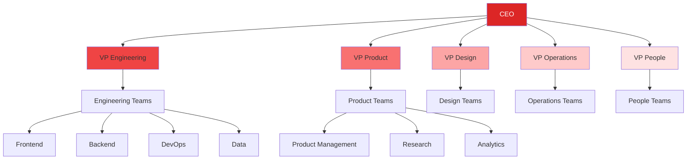
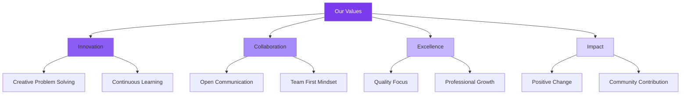
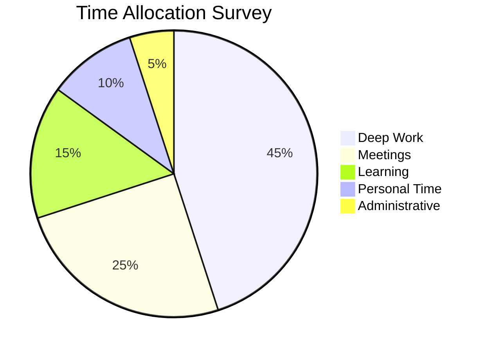
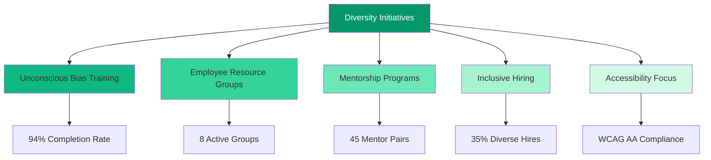
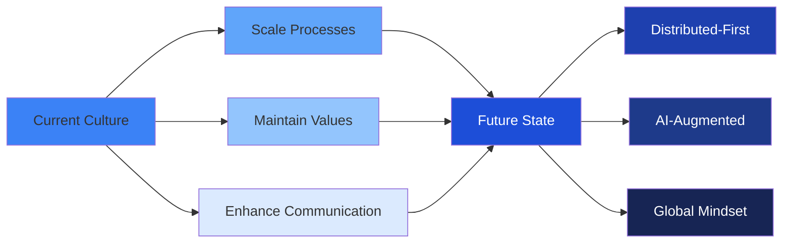

```json frontmatter
{
  "title": "Team Culture & Organizational Dynamics",
  "theme": {
    "mode": "auto",
    "colors": {
      "light": {
        "primary": "#dc2626",
        "secondary": "#64748b",
        "background": "#f8fafc",
        "surface": "#ffffff",
        "text": "#1e293b",
        "text-secondary": "#64748b"
      },
      "dark": {
        "primary": "#ef4444",
        "secondary": "#94a3b8",
        "background": "#0f1115",
        "surface": "#171a21",
        "text": "#ffffff",
        "text-secondary": "#cbd5e1"
      }
    }
  },
  "navigation": {
    "order": [
      "team-overview",
      "organizational-structure",
      "culture-values",
      "psychological-safety",
      "team-development",
      "work-life-balance",
      "diversity-inclusion",
      "team-stories",
      "future-culture",
      "glossary"
    ]
  },
  "hero": {
    "title": "People First",
    "subtitle": "Building a culture of innovation, collaboration, and growth that empowers every team member.",
    "callToAction": {
      "text": "Meet Our Team",
      "link": "#team-overview"
    }
  },
  "glossary": [
    { "term": "Psychological Safety", "definition": "A belief that one will not be punished or humiliated for speaking up with ideas, questions, or mistakes." },
    { "term": "Growth Mindset", "definition": "The belief that abilities and intelligence can be developed through dedication and hard work." },
    { "term": "Servant Leadership", "definition": "A leadership philosophy where the main goal is to serve others and help them grow." },
    { "term": "Agile Culture", "definition": "A work environment that embraces flexibility, collaboration, and continuous improvement." }
  ]
}
```

## Our Team Overview {#team-overview}

Our diverse team of 150+ professionals spans 12 countries and brings together expertise from technology, design, business, and creative fields. Each team member contributes unique perspectives that drive innovation and excellence.

```kpi-grid
[
  { "label": "Team Size", "value": "150+" },
  { "label": "Countries", "value": "12" },
  { "label": "Departments", "value": "8" },
  { "label": "Avg. Tenure", "value": "3.2 years" },
  { "label": "Diversity Score", "value": "94%" },
  { "label": "Retention Rate", "value": "92%" }
]
```

## Organizational Structure {#organizational-structure}

Our flat organizational structure encourages cross-functional collaboration and rapid decision-making while maintaining clear accountability.



## Our Core Values {#culture-values}

Our culture is built on four fundamental values that guide every decision and interaction within our organization.



### Psychological Safety {#psychological-safety}

> In psychologically safe teams, people feel confident that no one will embarrass or punish anyone else for admitting a mistake, asking a question, or offering a new idea.
>
> — Amy Edmondson, Harvard Business School

We foster an environment where every voice is heard and valued, creating the foundation for innovation and authentic collaboration.

## Professional Development {#team-development}

We invest heavily in our team's growth through structured learning programs, mentorship opportunities, and career development resources.

```kpi-grid
[
  { "label": "Training Hours/Year", "value": "120" },
  { "label": "Mentorship Pairs", "value": "45" },
  { "label": "Conference Budget", "value": "$50K" },
  { "label": "Certification Support", "value": "100%" },
  { "label": "Internal Mobility", "value": "78%" },
  { "label": "Promotion Rate", "value": "65%" }
]
```

## Work-Life Harmony {#work-life-balance}

We believe that sustainable performance comes from balanced, fulfilled team members who have the flexibility to manage their personal and professional lives effectively.



## Diversity & Inclusion {#diversity-inclusion}

Our commitment to diversity drives innovation and ensures we build products that serve a global user base effectively.



## Team Member Stories {#team-stories}

> The culture here made me grow from an individual contributor to a team lead in just 18 months. The mentorship and opportunities are incredible.
>
> — Alex Chen, Senior Engineer

> I've worked at 5 companies, and this is the first place where I truly feel my voice matters in strategic decisions.
>
> — Maria Rodriguez, Product Manager

> The focus on work-life balance here is genuine, not just lip service. I can be productive and still have a life.
>
> — James Wilson, UX Designer

## Culture Evolution {#future-culture}

As we grow, we're committed to evolving our culture while maintaining the core values that have made us successful.



## Culture Glossary {#glossary}

```glossary
```
