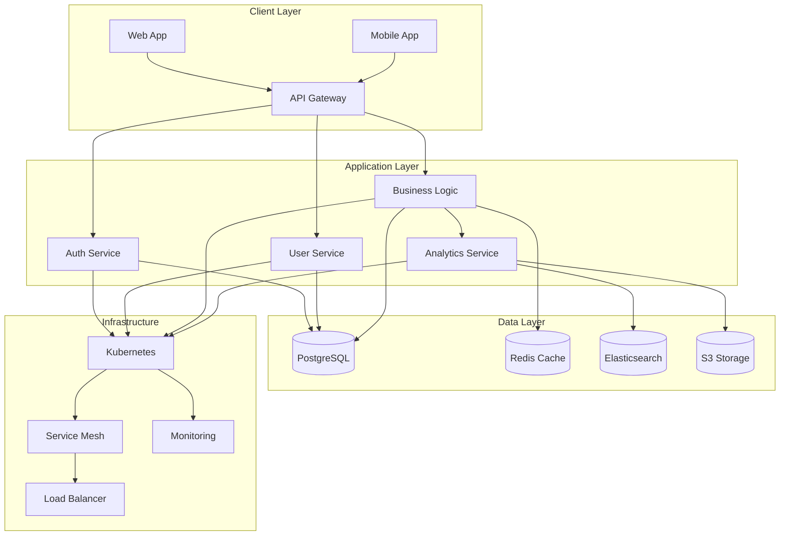
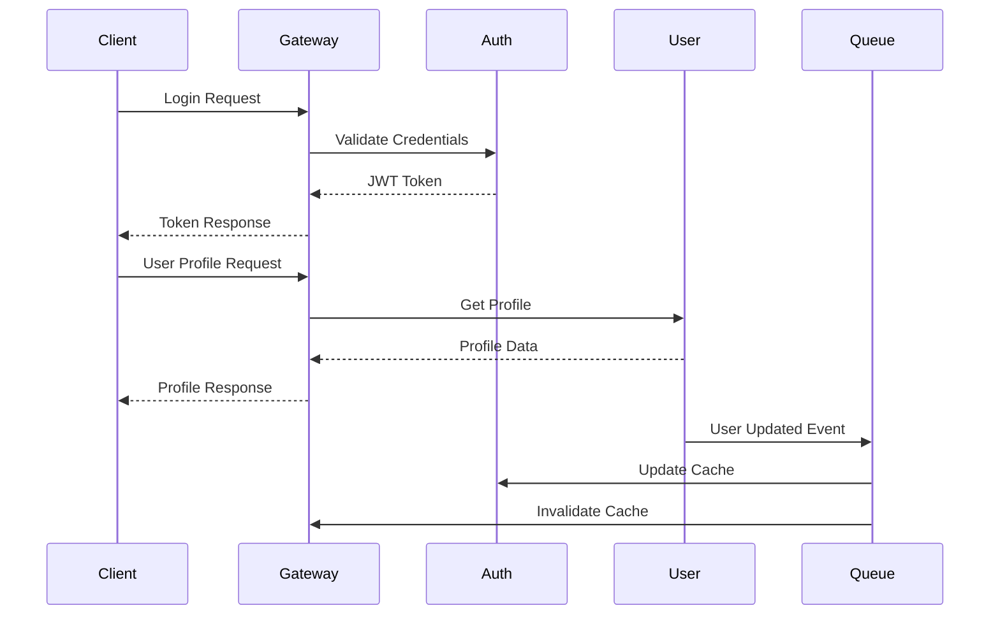
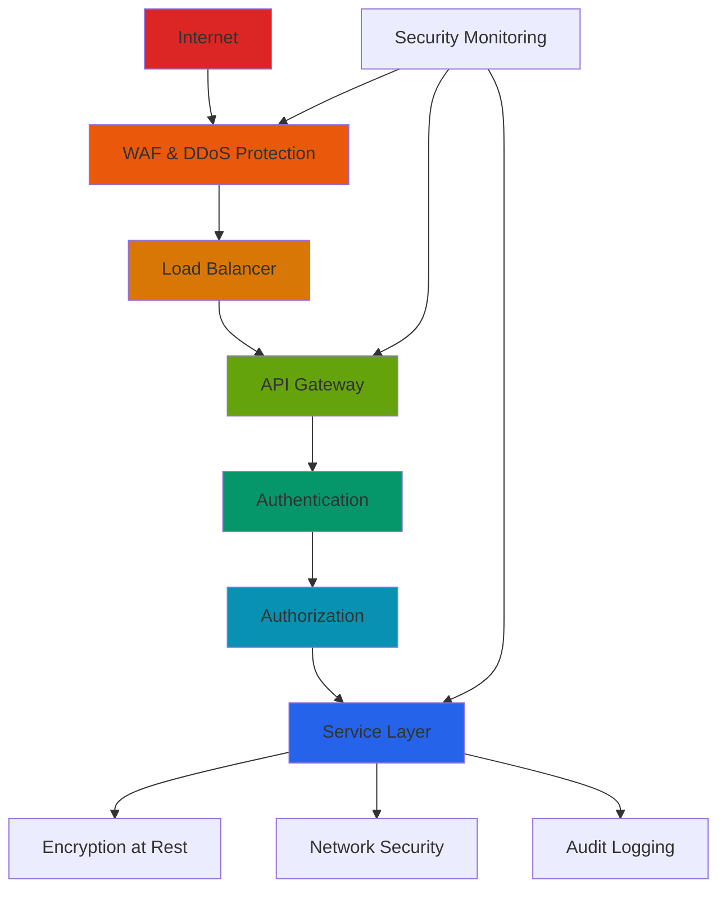
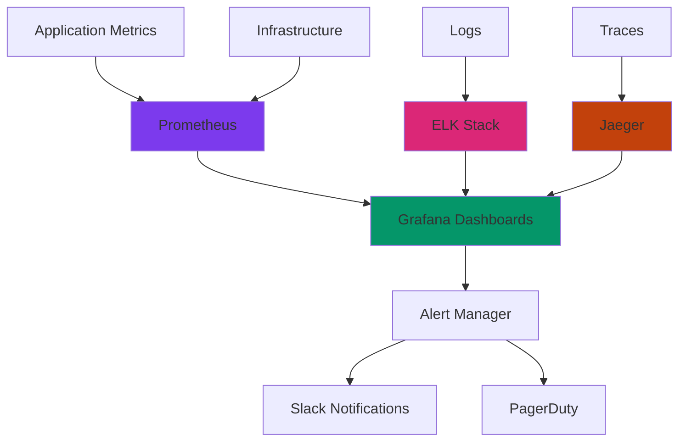

```json frontmatter
{
  "title": "System Architecture & Technical Deep Dive",
  "theme": {
    "mode": "light",
    "colors": {
      "light": {
        "primary": "#059669",
        "secondary": "#64748b",
        "background": "#f0fdf4",
        "surface": "#ffffff",
        "text": "#1a1a1a",
        "text-secondary": "#64748b"
      },
      "dark": {
        "primary": "#10b981",
        "secondary": "#6ee7b7",
        "background": "#064e3b",
        "surface": "#065f46",
        "text": "#f0fdf4",
        "text-secondary": "#a7f3d0"
      }
    }
  },
  "navigation": {
    "order": [
      "system-overview",
      "microservices",
      "service-communication",
      "data-architecture",
      "scalability",
      "security",
      "monitoring",
      "deployment",
      "glossary"
    ]
  },
  "hero": {
    "title": "CloudScale Architecture",
    "subtitle": "Enterprise-grade distributed systems designed for scale, reliability, and performance.",
    "callToAction": {
      "text": "Explore Architecture",
      "link": "#system-overview"
    }
  },
  "glossary": [
    { "term": "Microservices", "definition": "Architectural style that structures an application as a collection of small, independent services." },
    { "term": "Event-Driven", "definition": "Architecture pattern where components communicate through events and messages." },
    { "term": "CQRS", "definition": "Command Query Responsibility Segregation: Pattern separating read and write operations." },
    { "term": "Kubernetes", "definition": "Open-source platform for automating deployment, scaling, and management of containerized applications." },
    { "term": "Service Mesh", "definition": "Infrastructure layer for handling service-to-service communication." }
  ]
}
```

## System Architecture Overview {#system-overview}

CloudScale implements a modern distributed architecture that ensures high availability, scalability, and maintainability. The system is built on microservices principles with event-driven communication patterns.



## Microservices Architecture {#microservices}

Our microservices architecture allows for independent deployment, scaling, and maintenance of individual components while maintaining system coherence.

```mermaid
graph TD
    A[API Gateway] --> B[Auth Service]
    A --> C[User Management]
    A --> D[Order Service]
    A --> E[Payment Service]
    A --> F[Notification Service]

    B --> G[(Auth DB)]
    C --> H[(User DB)]
    D --> I[(Order DB)]
    E --> J[(Payment DB)]

    D --> K{Message Queue}
    K --> F
    E --> K

    style A fill:#10b981
    style B fill:#059669
    style C fill:#047857
    style D fill:#065f46
    style E fill:#064e3b
    style F fill:#022c22
```



### Service Communication Patterns {#service-communication}

Services communicate through a combination of synchronous REST APIs and asynchronous event-driven messaging.



## Data Architecture & Storage {#data-architecture}

Our data strategy employs polyglot persistence with different storage solutions optimized for specific use cases.

```mermaid
graph TD
    A[Application Data] --> B[(PostgreSQL)]
    A --> C[(MongoDB)]
    A --> D[(Redis)]
    A --> E[(Elasticsearch)]
    A --> F[(S3)]

    B --> G[Relational Data]
    C --> H[Document Data]
    D --> I[Caching Layer]
    E --> J[Search & Analytics]
    F --> K[File Storage]

    style B fill:#3b82f6
    style C fill:#1d4ed8
    style D fill:#1e40af
    style E fill:#1e3a8a
    style F fill:#172554
```



## Scalability & Performance {#scalability}

The architecture is designed to handle millions of requests while maintaining sub-second response times through intelligent caching and load distribution.

```kpi-grid
[
  { "label": "Concurrent Users", "value": "1M+" },
  { "label": "Response Time", "value": "< 200ms" },
  { "label": "Uptime SLA", "value": "99.99%" },
  { "label": "Auto-scaling", "value": "Instant" },
  { "label": "Global CDN", "value": "6 Regions" },
  { "label": "Data Replication", "value": "Multi-AZ" }
]
```

## Security Architecture {#security}

Security is implemented at every layer with defense-in-depth principles, including network segmentation, encryption, and continuous monitoring.



## Monitoring & Observability {#monitoring}

Comprehensive monitoring ensures system health, performance optimization, and rapid incident response.



## Deployment & CI/CD {#deployment}

Automated deployment pipelines ensure consistent, reliable releases with comprehensive testing and rollback capabilities.


## Technical Glossary {#glossary}

```glossary
```
