```json frontmatter
{
  "title": "Technical Documentation: API Reference & Developer Guide",
  "theme": {
    "mode": "light",
    "colors": {
      "light": {
        "primary": "#1e40af",
        "secondary": "#374151",
        "background": "#f8fafc",
        "surface": "#ffffff",
        "text": "#111827",
        "text-secondary": "#4b5563"
      },
      "dark": {
        "primary": "#3b82f6",
        "secondary": "#6b7280",
        "background": "#0f172a",
        "surface": "#1e293b",
        "text": "#f1f5f9",
        "text-secondary": "#cbd5e1"
      }
    }
  },
  "navigation": {
    "order": [
      "getting-started",
      "authentication",
      "api-reference",
      "code-examples",
      "architecture",
      "best-practices",
      "troubleshooting",
      "glossary"
    ]
  },
  "hero": {
    "title": "Technical Documentation",
    "subtitle": "Complete API reference and developer guide for seamless integration and development",
    "highlights": [
      {
        "metric": "API Endpoints",
        "value": "150+",
        "label": "Comprehensive coverage"
      },
      {
        "metric": "SDK Support",
        "value": "8 languages",
        "label": "Multi-platform"
      },
      {
        "metric": "Uptime SLA",
        "value": "99.99%",
        "label": "Enterprise reliability"
      }
    ],
    "callToActions": [
      {
        "text": "🚀 Get Started",
        "link": "#getting-started",
        "primary": true
      },
      {
        "text": "📚 API Reference",
        "link": "#api-reference",
        "primary": false
      },
      {
        "text": "💻 Code Examples",
        "link": "#code-examples",
        "primary": false
      }
    ]
  },
  "glossary": [
    { "term": "RESTful API", "definition": "An application programming interface that conforms to the constraints of REST architectural style." },
    { "term": "OAuth 2.0", "definition": "An authorization framework that enables applications to obtain limited access to user accounts." },
    { "term": "JWT", "definition": "JSON Web Token: A compact, URL-safe means of representing claims between two parties." },
    { "term": "Webhook", "definition": "A method of augmenting or altering the behavior of a web page with custom callbacks." },
    { "term": "Rate Limiting", "definition": "A technique to control the rate of requests sent or received by a network interface controller." },
    { "term": "SDK", "definition": "Software Development Kit: A collection of software development tools in one installable package." }
  ]
}
```

## Getting Started {#getting-started}

Welcome to our comprehensive API documentation. This guide will help you get up and running with our platform in minutes, whether you're building a simple integration or a complex enterprise application.

```kpi-grid
[
  { "label": "Setup Time", "value": "< 5 minutes" },
  { "label": "Free Tier", "value": "10,000 requests" },
  { "label": "Support", "value": "24/7 available" },
  { "label": "Languages", "value": "8 SDKs" },
  { "label": "Regions", "value": "12 global" },
  { "label": "Security", "value": "Bank-grade" }
]
```

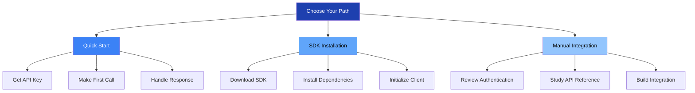

## Authentication & Security {#authentication}

Our authentication system uses industry-standard OAuth 2.0 with JWT tokens for secure, scalable access control. We support multiple authentication flows to meet different integration requirements.

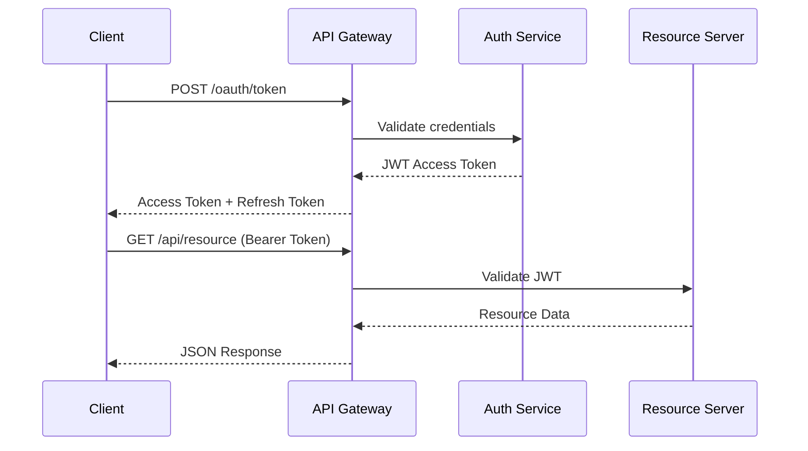

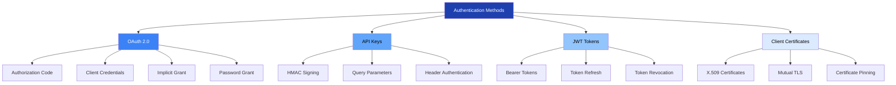

```kpi-grid
[
  { "label": "Token Lifetime", "value": "1 hour" },
  { "label": "Refresh Window", "value": "30 days" },
  { "label": "Encryption", "value": "AES-256" },
  { "label": "Rate Limits", "value": "10,000/hour" },
  { "label": "Failed Attempts", "value": "5 max" },
  { "label": "Lockout Period", "value": "15 minutes" }
]
```

## API Reference {#api-reference}

Our RESTful API provides comprehensive access to all platform features with consistent patterns, detailed error handling, and extensive documentation.

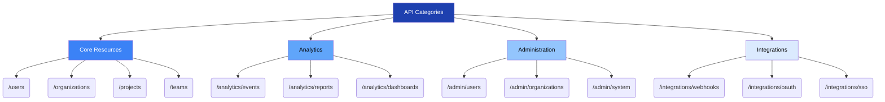

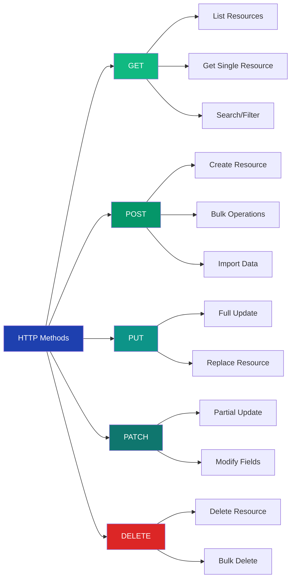

```kpi-grid
[
  { "label": "Response Time", "value": "< 200ms" },
  { "label": "Success Rate", "value": "99.9%" },
  { "label": "Error Rate", "value": "< 0.1%" },
  { "label": "Pagination", "value": "Cursor-based" },
  { "label": "Filtering", "value": "Advanced" },
  { "label": "Versioning", "value": "Header-based" }
]
```

## Code Examples & SDKs {#code-examples}

We provide official SDKs for all major programming languages with comprehensive code examples, documentation, and community support.

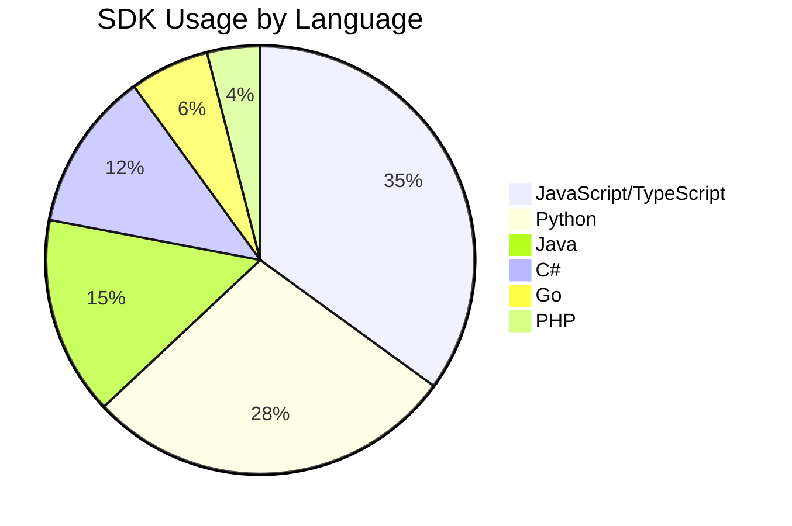

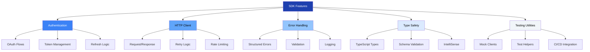

```kpi-grid
[
  { "label": "SDK Downloads", "value": "2.5M/month" },
  { "label": "Community PRs", "value": "450+" },
  { "label": "Issues Resolved", "value": "98%" },
  { "label": "Documentation", "value": "100% coverage" },
  { "label": "Test Coverage", "value": "95%+" },
  { "label": "Security Audits", "value": "Quarterly" }
]
```


## System Architecture {#architecture}

Our distributed architecture ensures high availability, scalability, and performance across global regions with comprehensive monitoring and automated failover capabilities.

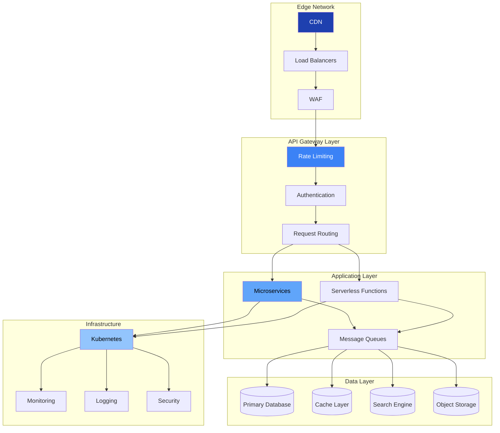

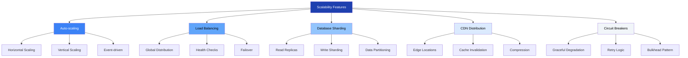

## Best Practices & Guidelines {#best-practices}

Following these best practices ensures optimal performance, security, and maintainability of your integrations with our platform.

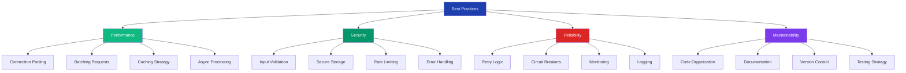

```kpi-grid
[
  { "label": "Performance Boost", "value": "+300%" },
  { "label": "Error Reduction", "value": "80%" },
  { "label": "Maintenance Cost", "value": "-40%" },
  { "label": "Security Score", "value": "A+" },
  { "label": "Reliability", "value": "99.99%" },
  { "label": "Developer Satisfaction", "value": "96%" }
]
```

## Troubleshooting & Support {#troubleshooting}

Our comprehensive troubleshooting guide and 24/7 support ensure you can resolve issues quickly and maintain smooth operations.

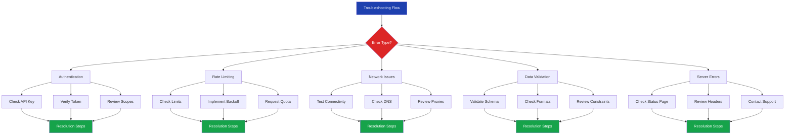

```kpi-grid
[
  { "label": "Avg Resolution Time", "value": "4.2 hours" },
  { "label": "Self-Service Rate", "value": "68%" },
  { "label": "Support Satisfaction", "value": "4.8/5" },
  { "label": "Documentation Coverage", "value": "95%" },
  { "label": "Community Answers", "value": "42%" },
  { "label": "Escalation Rate", "value": "3%" }
]
```

> The best APIs are not just powerful, they're predictable and well-documented. Our commitment to developer experience means you can focus on building amazing products, not fighting with integrations.
>
> — Dr. Sarah Chen, Head of Developer Relations

## Technical Glossary {#glossary}

```glossary
```
